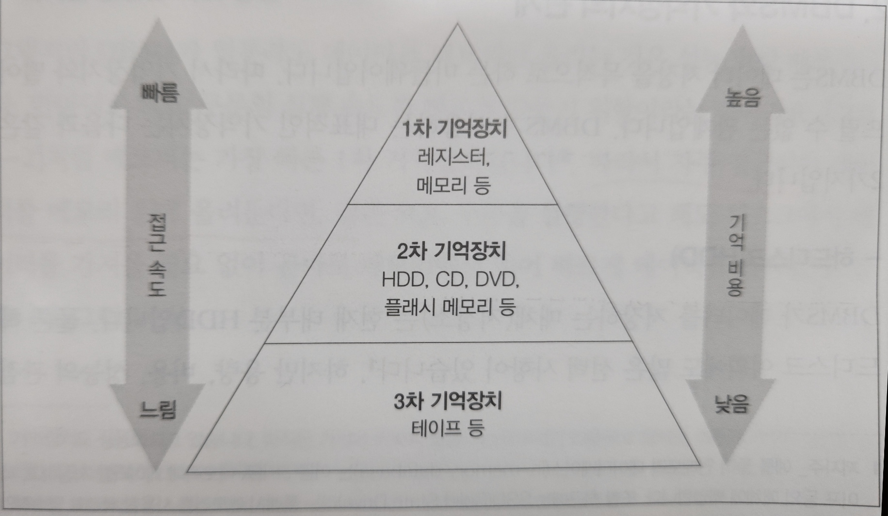
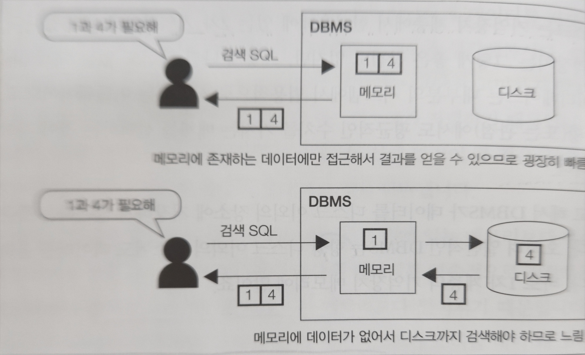
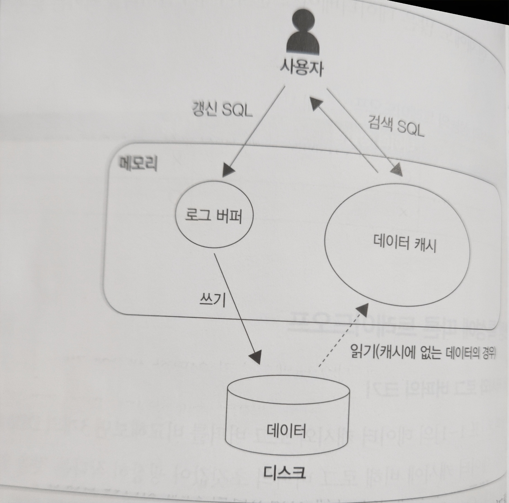

# DBMS와 버퍼
- DBMS는 특별한 용도로 사용하는 **버퍼**라는 메모리 영역을 확보해둔다.
- 버퍼는 성능에 굉장히 중요한 영향을 미치며, 컴퓨터에 메모리는 한정된 희소 자원이다.
- 하지만 DBMS가 메모리에 저장하길 원하는 데이터는 굉장히 많다.
- 따라서 DBMS 성능을 위해 버퍼 매니저가 버퍼를 최대한 효율적으로 관리할 필요가 있다.

## 기억장치의 계층

- 기억장치는 **기억 비용**에 따라 1차부터 3차까지의 계층으로 분류된다.
  - 기억비용: 데이터를 저장하는데 소모되는 비용
- 위로 갈수록 데이터 접근 속도가 훨씬 빠르지만, 상대적으로 용량은 적다.

## DBMS와 기억장치의 관계
### 하드디스크
- DBMS는 대부분 하드디스크에 데이터를 저장한다.
- DBMS는 디스크뿐만이 아닌, 메모리에도 데이터를 담는다.

### 메모리
- 메모리는 디스크에 비해 **비용이 비싸고**, 그만큼 사용 가능한 부분이 **한정적이다**.

### 버퍼를 활용한 속도 향상
- DBMS가 일부라도 데이터를 메모리에 올리는 이유는 **성능 향상**을 얻기 위함이다.
- 자주 접근하는 데이터를 메모리에 올려둔다면, 같은 SQL 구문을 실행한다고 해도 디스크에 접근하는 것보다 곧바로 메모리에 접근할 수 있기에 훨씬 빠르게 가져올 수 있다.
- 이렇게 성능 향상을 목적으로 저장하는 메모리를 **버퍼** 또는 **캐시**라고 부른다.
- 이런 버퍼에 **데이터를 어떻게**, **어느정도 기간 동안** 올릴 것인지를 관리하는 것이 **버퍼 매니저**이다.

## 메모리 위에 있는 두 개의 버퍼
- DBMS가 사용하는 메모리는 크게 두 가지가 있다.

### 데이터 캐시
- 데이터캐시 조회: `SHOW VARIABLES LIKE 'innodb_buffer_pool_size'`
- 데이터 캐시는 디스크 데이터 일부를 메모리에 유지하기 위해 사용하는 영역이다.
- SELECT 실행한 데이터가 모두 데이터 캐시에 있다면, 디스크에 접근하는 것보다 훨씬 빠르게 값을 가져온다.

### 로그 버퍼
- 로그버퍼 조회: `SHOW VARIABLES LIKE 'innodb_log_buffer_size'`
- 로그 버퍼는 **갱신 처리**(INSERT, DELETE, UPDATE)와 관련이 있다.
- DBMS는 갱신 관련 SQL 구문을 받고 **곧바로 저장소의 데이터를 변경하지 않는다.**
- 일단 로그 버퍼에 변경 정보를 올려놓고 이후에 디스크에 있는 데이터 변경을 수행한다.
- SQL 구문을 실행할 때 저장소의 데이터를 바로 변경하지 않는 이유 또한 **성능을 높이기 위해서**이다.
  - 저장소는 검색뿐만 아니라, 갱신에도 시간이 오래걸릴 수 있고 이를 기다리면 사용자에겐 지연으로 이어진다. 
  - 그래서 사용자는 수행할 SQL만 전달하고(비동기), 완료 통지를 받는다.
    - **사용자에겐 완료 통지를 했지만, DBMS 내부에서는 해당 처리를 계속 수행한다.**

## 메모리의 성질이 초래하는 트레이드오프

### 휘발성
- 메모리 데이터는 영속성이 없다. 
- 전원이 꺼지면 데이터도 모두 사라지게 되는 성질을 **휘발성**이라고 한다.
- 영속성이 없는 이상 기능적으로 디스크를 대체하는 것은 불가하다.

### 휘발성의 문제점
- 휘발성의 치명적인 문제는 장애 발생 시 의도치않게 메모리에 있던 데이터가 모든 데이터가 사라져 **데이터 부정합**을 일으킨다는 것이다.

## 시스템 특성에 따른 트레이드오프
### 데이터 캐시와 로그 버퍼의 크기

- 데이터 캐시에 비해 상대적으로 로그 버퍼의 초깃값이 훨씬 작게 되어있다. 
- 데이터베이스는 기본적으로 검색을 메인으로 처리한다고 가정하였기 때문이다.
- 일반적으로 갱신에 사용되는 대상 수보다 검색 대상 수가 훨씬 많다고 가정하여 초기 설정이 이루어진 것이다.

### 검색과 갱신 중에서 중요한 것
- 검색과 갱신 중 어떤 것을 우선시되어야 하는 것은 트레이드오프 상황이다.
- 물론 메모리가 매우 많다면 이러한 고민이 필요 없을 것이다.
- 최근의 DBMS는 발전 중이고, 리소스를 자동으로 조정하는 기능도 나왔으며, 메모리 할당도 스스로 조정할 수 있음에도 한계가 있다.
- 리소스 조정이 굉장히 중요한 상황에서, 별 생각 없이 자동 설정에 의지하는 것은 위험하다.

- 로그 버퍼가 크다면 **갱신 처리**를 염두한 것이고, 데이터 캐시가 크다면 **검색 처리**에 중점을 둔 것으로 유추할 수 있다.

## 워킹 메모리
- DBMS는 앞에 2개 버퍼 외에도, 메모리 영역을 하나 더 갖고 있다.
- **워킹메모리:** 정렬 또는 해시 관련 처리에 사용되는 작업용 영역