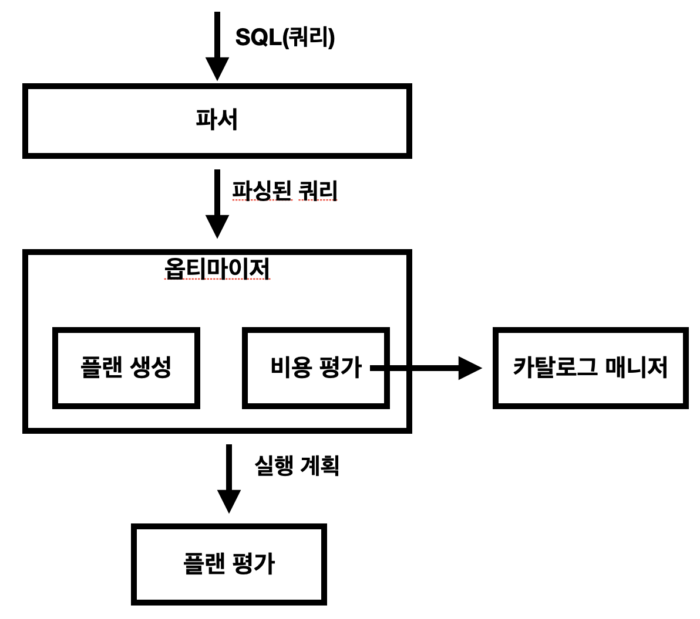

# DBMS 아키텍처 개요
사용자에게 전달받은 SQL 구문은 DBMS를 통해 다양한 처리를 수행한 뒤 저장 장치의 데이터에 접근해 데이터를 읽고 쓴다

## 쿼리 평가 엔진
- SQL 구문을 분석하고, 어떤 순서로 기억장치의 데이터에 접근할지를 결정
- 이때 결정되는 계획을 `실행 계획`이라고 부름
- 이러한 실행 계획에 기반을 둬서 데이터에 접근하는 방법을 `접근 메서드`라고 부름
- 즉, 쿼리 평가 엔진은 **계획을 세우고 실행하는 모듈**

## 버퍼 매니저
- DBMS는 버퍼라는 특별한 용도로 사용하는 **메모리 영역**을 확보
- 버퍼 매니저 메모리 영역을 관리
- 버퍼 매니저는 디스크 용량 매니저와 함께 연동되어 작동

## 디스크 용량 매니저
- 디스크 용량 매니저는 어디에 어떻게 데이터를 저장할지 관리하며, 데이터의 읽고 쓰기를 제어

## 트랜잭션 매니저와 락 매니저
- 트랜잭션의 정합성을 유지하면서 실행시키고, 필요한 경우 데이터에 락을 걸어 다른 사람의 요처을 대기시키는 역할

## 리커버리 매니저
- 장애에 대비해 데이터를 정기 백업하고, 문제 발생 시 복구하는 기능을 수행

# DBMS와 버퍼
메모리는 한정된 희소 자원이고, 데이터베이스가 메모리에 저장하고자 하는 데이터는 굉장히 많음

## DBMS와 기억장치의 관계
- DBMS는 데이터 저장 목적의 미들웨어이므로 기억장치와 떨어 뜨릴 수 없는 관계이다.
- DBMS가 사용하는 대표적인 기억장치는 **하드디스크**, **메모리**이다.

### 하드디스크(HDD)
- DBMS가 데이터를 저장하는 매체(저장소)는 대부분 하드디스크이다.
    - 하드디스크 외 많은 선택지가 있지만 용량, 비용, 성능 관점에서 대부분 하드디스크를 선택한다.
- DBMS는 항상 메모리에도 데이터를 보관한다.

### 메모리
- 메모리는 하드디스크에 비해 기억 비용이 굉장히 비싸다.
- 따라서 데이터베이스의 데이터를 전부 메모리에 올리는 것은 불가능하다.

### 버퍼를 활용한 속도 향상
- DBMS가 일부여도 데이터를 메모리에 올리는 이유는 **성능 향상** 때문이다.
    - 한마디로 SQL 구문의 실행 속도를 빠르게 만들기 위함이다.
- 자주 접근하는 데이터를 메모리에 올려둔다면, 같은 SQL 구문을 실행하더라도 디스크가 아닌 메모리에서 데이터를 읽어 빠르게 검색할 수 있다.
- **디스크 접근을 줄일 수 있다면 굉장히 큰 폭의 성능 향상**이 가능하다.
- 이렇게 성능 향상을 목적으로 데이터를 저장하는 메모리를 **버퍼** 또는 **캐시**라고 부른다.
- 버퍼는 완충제라는 의미이며, 사용자와 저장소 사이에서 SQL 구문의 디스크 접근을 줄여주는 역할을 하여 붙은 이름이다.
- 버퍼에 **데이터를 어떻게, 어느 저옫의 기간 동안 올릴지**를 관리하는 것이 DBMS의 **버퍼 매니저**이다.


## 메모리 위에 있는 두 개의 버퍼
- DBMS가 데이터를 유지하기 위해 사용하는 메모리는 크게 `데이터 캐시`, `로그 버퍼`가 있다.

### 데이터 캐시
- 데이터 캐시는 디스크에 있는 **데이터의 일부를 메모리에 유지하기 위해** 사용하는 메모리 영역이다.
- SELECT 구문에서 선택할 데이터가 **모두 데이터 캐시에 있다면** 디스크에 접근하지 않고 처리가 수행되어 굉장히 빠르게 응답한다.

### 로그 버퍼
- 로그 버퍼는 **갱신 처리**(`INSERT`, `DELETE`, `UPDATE`, `MERGE`)에 관련이 있다.
- DBMS는 갱신 SQL 구문을 받으면, 저장소에 있는 데이터를 **곧바로 변경하지 않고 먼저 로그 버퍼** 위에 변경 정보를 보낸 이후 디스크에 변경을 수행한다.
    - 갱신 처리는 SQL 구문의 실행 시점과 저장소에 갱신하는 시점에 차이가 있는 **비동기 처리**이다.
- 단순히 저장소 상의 파일을 바로 변경하는 방법이 간단하겠지만, 이렇게 시점 차이를 두는 이유는 **성능 때문**이다.
- 저장소는 검색뿐만 아니라 갱신할 때도 상당한 시간이 소모되고, 사용자는 저장소 변경이 끝날 때까지 장기간 대기하게 될 수 있다.
- 따라서 **한 번 메모리에 갱신 정보를 받은 시점에 사용자에게는 SQL 구문이 끝났다라고 통지하고, 내부적으로 관련된 처리를 계속 수행한다.** (비동기)

## 메모리의 성질이 초래하는 트레이드오프
메모리는 한정된 희소 자원이라는 단점도 있지만, 사실 이 외에도 몇 가지 단점이 더 있다.

### 휘발성
- 메모리에는 **데이터 영속성이 없어** 전원이 꺼지면 데이터가 모두 사라지는데, 이를 **휘발성**이라고 한다.
- 때문에 미래에 메모리 비용이 저렴하다고 하더라도 영속성이 없는 이상 디스크를 완전히 대체하는 것은 불가능하다.

### 휘발성의 문제점
- 휘발성의 가장 큰 문제는 장애가 발생했을 때 메모리의 데이터가 모두 사라져 **데이터 부정합**을 발생시키는 것이다.
- 데이터 캐시는 메모리 데이터가 모두 사라져버려도 원본 데이터는 디스크에 남아있어 문제되지 않는다.
- 반면에, 로그 버퍼의 경우에는 갱신문이 디스크 파일에 반영되기 전에 장애가 발생하여 사라지게 된다면 복구가 불가능하다.
- 따라서 이를 회피하기 위해 DBMS는 **커밋 시점에 갱신 정보를 로그 파일**(저장소 위)에 씀으로써, 장애가 발생해도 정합성을 유지할 수 있도록 한다.
- `커밋(Commit)`이란 갱신 처리를 **확정**하는 것이고, DBMS는 커밋된 데이터를 영속화한다.
- 커밋 때는 반드시 디스크에 동기 접근이 일어나 **지연**이 발생할 가능성이 있다.

## 시스템 특성에 따른 트레이드오프
### 데이터 캐시와 로그 버퍼의 크기
- DBMS 설정 기본값에서 **데이터 캐시에 비해 로그 버퍼의 초깃값이 굉장히 작게** 되어 있다.
- 이는 데이터베이스가 기본적으로 **검색을 중심으로 처리한다고 가정**하기 때문이다.
    - 갱신 처리에 메모리를 많이 사용하는 것보단, 자주 검색하는 데이터를 캐시에 올려놓는 것이 좋다고 판단하는 것이다.
- 만약 검색에 비해 갱신이 많은 시스템이라면, 로그 버퍼의 크기를 늘리는 튜닝을 고려해볼 필요가 있을 것이다.

### 검색과 갱신 중에서 중요한 것
- 메모리는 값비싼 희소 자원이므로 어떤 것을 우선해야 할지에 대한 트레이드오프가 있다.
- **로그 버퍼가 크면 갱신** 처리의 부하를 고려한 설계이고, **데이터 캐시가 크면 검색** 처리에 중심을 두었다는 것을 생각할 수 있다.

## 추가적인 메모리 영역 `워킹 메모리`
### 언제 사용될까?
- DBMS는 2개의 버퍼 이외에도, 일반적으로 메모리 영역을 하나 더 가지고 있다.
- 이는 정렬 또는 해시 관련 처리에 사용되는 영역으로 **워킹 메모리**라고 부른다.
- 워킹 메모리는 SQL에서 정렬 또는 해시가 **필요할 때 사용되고, 종료되면 해제되는 임시 영역**으로, 일반적으로는 데이터 캐시와 로그 버퍼와는 다른 영역으로 관리되는 경우가 많다.
- 이 영역이 성능적으로 중요한 이유는, 다루려는 **데이터양보다 메모리가 작아 부족해지는 경우**가 생기면 저장소를 사용하기 때문이다.

### 부족하면 무슨 일이 일어날까?
- 메모리가 부족하다고 처리가 멈추거나 에러가 발생하는 것은 아니지만, 디스크에 접근하므로 메모리에 비해 굉장히 느리다.
- 워킹 메모리는 여러 개의 SQL 구문들이 공유해서 사용하므로, 여러 SQL 구문을 동시에 실행하면 메모리가 넘칠 수 있다.
- DBMS는 메모리가 부족하더라도 무언가를 처리하기 위해 계속 노력하는 미들웨어라고 생각할 수 있다.
- DBMS도 여타 프로그램처럼 메모리가 부족하면 처리를 중단시키거나 할 수 있지만, 느려지더라도 끝까지 처리하기 위해 노력한다.


# DBMS와 실행 계획
개발자가 데이터베이스에서 의식적으로 사용하는 것은 SQL 레벨까지이다. 이후 모든 것은 SQL 구문을 읽어들인 DBMS가 알아서 처리하고 결과를 제공해준다. 따라서 사용자는 데이터의 위치를 알 필요도, 접근하는 방법도 따로 생각하지 않는다. SQL 작성 외 모든 것을 DBMS에게 맡긴다.

## 권한 이양의 죄악
- 사용자는 SQL만 작성하면 되지만, 아직 우리는 RDB를 다루기 어려워 한다.
- SQL은 생각보다 간단한 언어가 아니고, DBMS가 대부분을 처리해 주는 점에서 **How**를 의식하지 않고 사용하는 것 때문에 성능 문제로 고생하는 경우가 많다.
- 따라서 RDB가 숨기고 있는 내부 시스템을 들여다볼 줄 알아야 한다.

## 데이터에 접근하는 방법은 어떻게 결정할까?
- 앞서 보았듯이, RDB에서 데이터 접근 절차를 결정하는 모듈은 쿼리 평가 엔진이다.
- 쿼리 평가 모듈은 추가로 파서 또는 옵티마이저와 같은 여러 개의 서브 모듈로 구성된다.

###### **_DBMS의 쿼리 처리 흐름_**


### 파서
- 파서는 SQL 구문을 검사하고, DBMS 내부에서 일어나는 후속 처리를 효율화하기 위해 SQL 구문을 정형적인 형식으로 변환한다.
- 프로그래밍 언어에서의 컴파일과 비슷한 느낌

### 옵티마이저
- 파서를 통과한 쿼리는 옵티마이저로 전송된다.
- 옵티마이저는 한국어로 **최적화**이며, 최적화 대상은 데이터 접근법(실행 계획)이다. 옵티마이저가 DBMS 두뇌의 핵심이다.
- 옵티마이저는 선택 가능한 많은 실행 계획을 작성하고, 비용을 연산하고, **가장 낮은 비용을 가진 실행 계획을 선택**한다.

### 카탈로그 매니저
- 옵티마이저가 실행 계획을 세우기 위한 중요한 정보를 제공하는 것이 카탈로그 매니저이다.
- 카탈로그란 DBMS의 내부 정보를 모아놓는 테이블들로, 테이블 또는 인덱스의 통게 정보가 저장되어 있다.

### 플랜 평가
- 여러 개의 실행 계획 중 최적의 실행 결과를 선택하는 것이 플랜 평가이다.
- 실행 계획은 DBMS가 실행하는 코드 형태가 아닌, 인간이 읽는 문자 그대로의 게획서이다.
- 따라서 **성능이 좋지 않은 SQL 구문의 실행 계획을 읽고, 수정 방안 등을 고려할 수 있다.**
- 이렇게 하나의 실행 계획을 선택하면, 이후 DBMS는 실행 계획을 절차적 코드로 변환하고 데이터 접근을 수행한다.


## 옵티마이저와 통계 정보
- 카탈로그 매니저가 관리하는 통계 정보에 대해 항상 신경을 써야 한다.
- 옵티마이저가 실행 계획을 선택함에 있어, 실제로 최적의 계획을 선택하지 않는 경우가 꽤 있다.
- 옵티마이저가 실패하는 패턴이 몇 가지 있는데, 통계 정보가 부족한 경우가 대표적인 원인으로 꼽힌다.
- 카탈로그에 포함된 통계 정보는 다음과 같다.
    - 각 테이블의 레코드 수
    - 각 테이블의 필드 수와 필드의 크기
    - 필드의 카디널리티
    - 필드값의 히스토그램
    - 필드 내부의 있는 NULL 수
    - 인덱스 정보
- 문제가 발생하는 경우는 이러한 카탈로그 정보와 실제 테이블 또는 인덱스 정보와 일치하지 않을 때이다.
- 테이블에 갱신이 될 때, 카탈로그 정보가 같이 갱신되지 않았다면 옵티마이저는 오래된 정보를 바탕으로 실행 계획을 세우게 된다.
- 예를 들면, 임의 테이블에 데이터가 0 건이고, 1억 건의 데이터를 올린 뒤 카탈로그 정보를 갱신하지 않는다면 옵티마이저는 0건의 데이터를 바라보고 실행 계획을 세운다.

## 최적의 실행 계획이 작성되게 하려면
- 올바른 통계 정보가 모이는 것은 SQL 성능에 있어 굉장히 중요한 문제이다.
- 통계 정보 갱신은 테이블 또는 인텍스의 크기와 수에 따라 몇십 분에서 몇 시간이 소요되기도 하는 **실행 비용이 굉장히 높은 작업**이다.
- 하지만 최적의 실행 계획을 위해 갱신 시점을 잘 검토해야 한다.

```sql
[MySQL 통계 정보 갱신 명령어]
ANALYZE TABLE [스키마].[테이블]
```