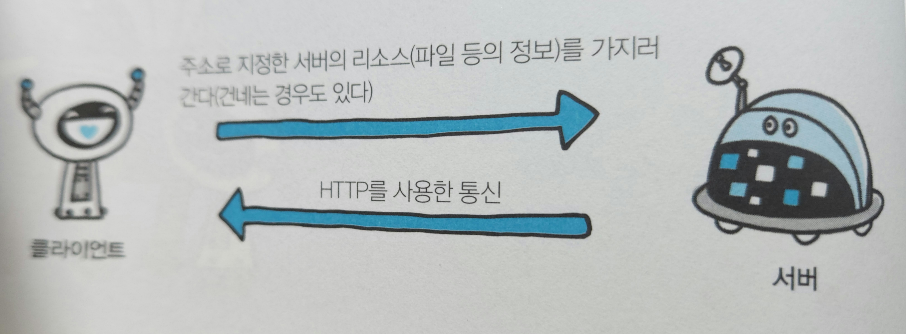
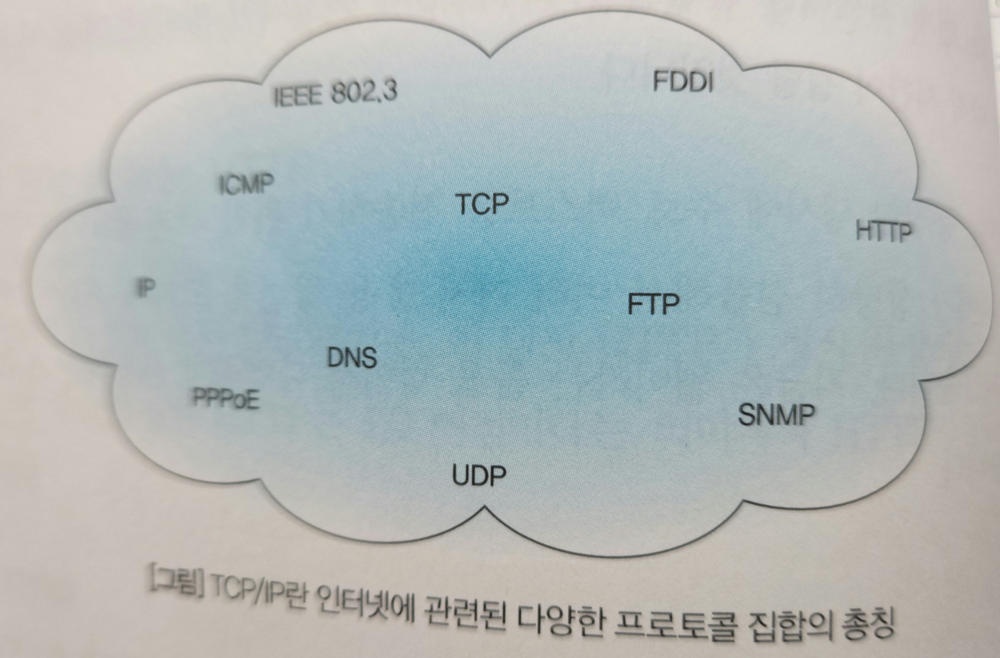
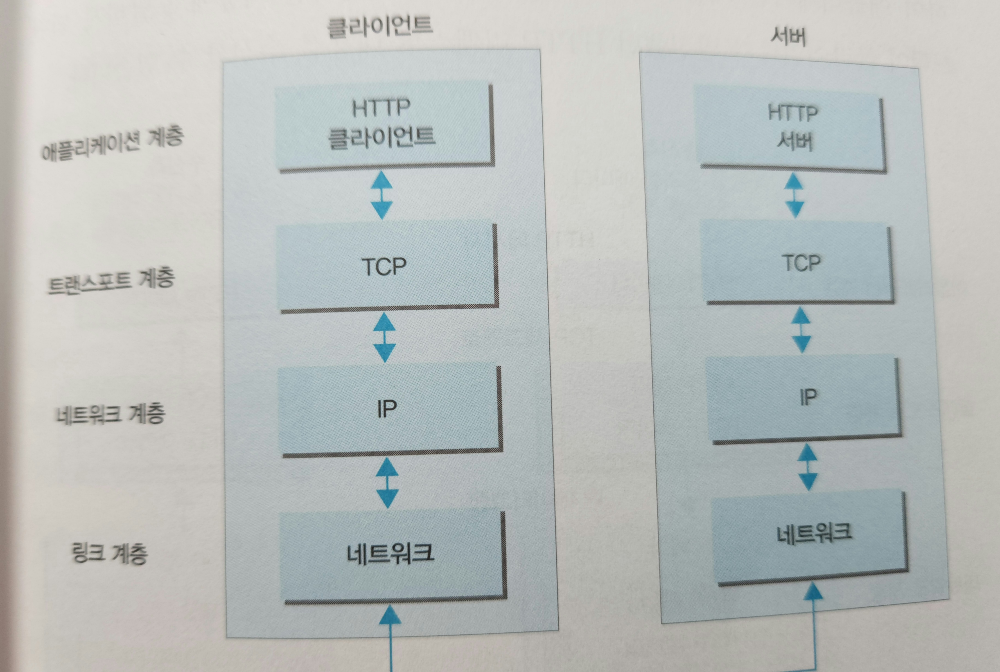
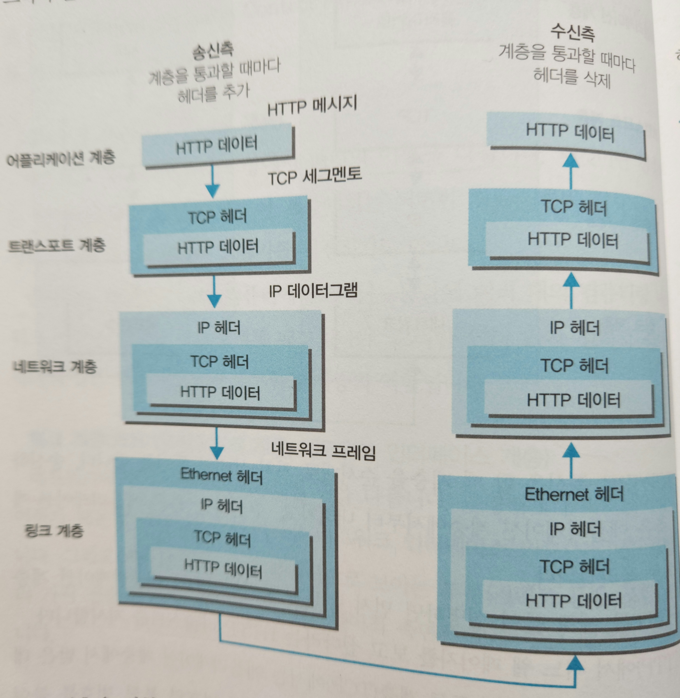
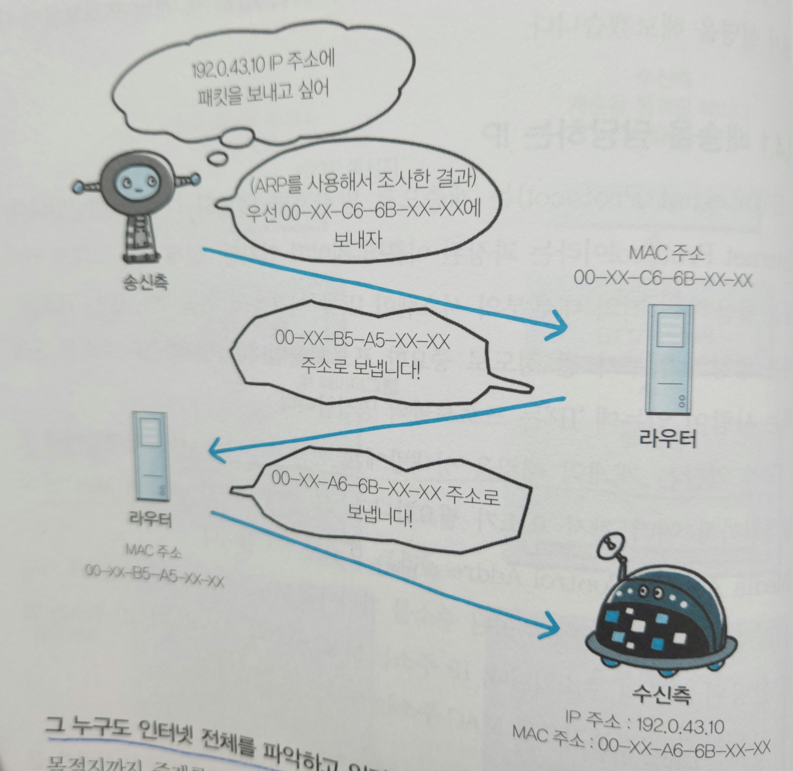
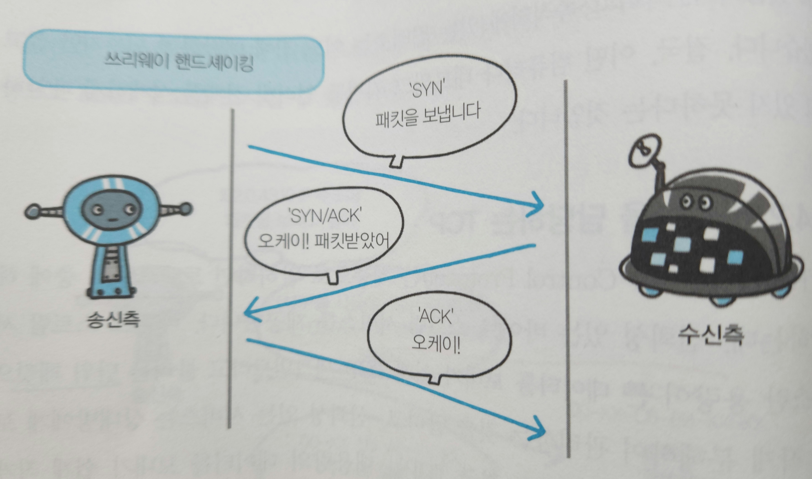
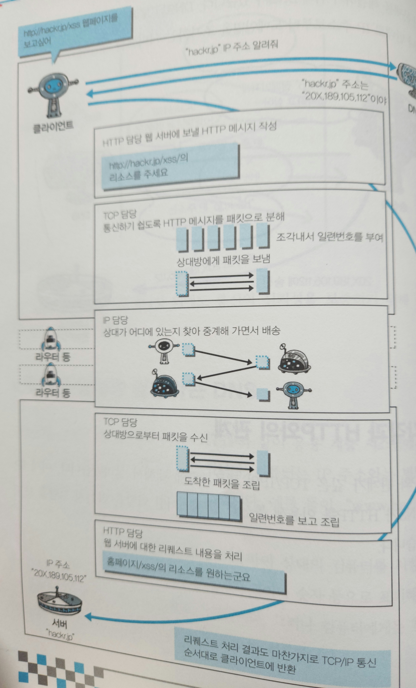

# 웹과 네트워크의 기본
아래 내용은 [그림으로 배우는 HTTP & Network Basic](http://www.kyobobook.co.kr/product/detailViewKor.laf?ejkGb=KOR&mallGb=KOR&barcode=9788931447897&orderClick=LEa&Kc=)를 읽고 정리한 내용입니다.

이 글에서는 웹이라는 세계가 어떤 기술로 구성되어 있고, HTTP의 배경이 되는 전반적인 내용을  다룹니다.

## 웹은 HTTP로 나타낸다
웹 브라우저는 주소 입력란에 지정된 URL에 의지해서 웹 서버로부터 리소스라고 불리는 파일 등의 정보를 얻습니다.

이 때, 서버에 의뢰하는 웹 브라우저 등을 클라이언트라고 부릅니다.  

클라이언트에서 서버까지 일련의 흐름을 결정하고 있는 것은 웹에서 HTTP(HyperText Transfer Protocol)이라 불리는 프로토콜입니다.

프로토콜의 의미는 "약속"입니다. 즉, 웹은 HTTP라는 약속을 통한 통신으로 이루어져 있습니다.

## 네트워크의 기본은 TCP/IP
인터넷을 포함하여 일반적으로 사용하고 있는 네트워크는 TCP/IP 프로토콜에서 움직이고 있고, HTTP도 그 중 하나입니다.

### TCP/IP는 프로토콜의 집합
컴퓨터와 네트워크 기기가 상호간에 통신하기 위해서는 서로 같은 방법으로 통신해야 합니다.  
서로 다른 하드웨어와 운영체제를 가지고 서로 통신을 하기 위해서는 모든 요소에 규칙이 필요하고, 이러한 규칙을 프로토콜이라고 부릅니다.  

인터넷과 관련된 프로토콜들을 모은 것을 TCP/IP라고 부릅니다.  
TCP와 IP를 가리켜 TCP/IP라고 부르기도 하지만, IP 프로토콜을 사용한 통신에서 사용되고 있는 프로토콜을 총칭해서 TCP/IP라는 이름이 사용되고 있습니다.

### 계층으로 관리하는 TCP/IP
TCP/IP에서 중요한 개념 중 하나가 계층(Layer)입니다.  
TCP/IP는 **애플리케이션 계층**, **트랜스포트 계층**, **네트워크 계층**, **링크 계층** 이렇게 4계층으로 나뉘어 있습니다.  

TCP/IP를 계층화하여 아래와 같은 메리트를 얻을 수 있습니다.
- 사양이 변경되었을 때, 전체가 아닌 변경해야 할 계층만 바꾸면 된다.
- 본인 계층이 담당할 부분만 고려하면 되어 설계를 편하게 할 수 있다.

TCP/IP 각 계층의 역할은 다음과 같습니다.

#### 애플리케이션 계층
애플리케이션 계층은 유저에게 제공되는 애플리케이션에서 사용되는 통신의 움직임을 결정합니다.  
TCP/IP에는 여러 가지의 공통 애플리케이션이 존재합니다.  
예를 들면, FTP와 DNS 등도 애플리케이션의 한 가지이며 HTTP도 이 게층에 포함됩니다.

#### 트랜스포트 계층
트랜스포트 계층은 애플리케이션 계층에 네트워크로 접속되어 있는 2대의 컴퓨터 사이의 데이터 흐름을 제공합니다.  
트랜스포트 계층에서는 서로 다른 성질을 가진 TCP와 UDP 두 가지 프로토콜이 있습니다.

#### 네트워크 계층
네트워크 계층은 네트워크 상에서 전송하는 데이터의 최소 단위인 패킷의 이동을 다룹니다.  
이 계층에서는 어떠한 경로(절차)를 거쳐 상대 컴퓨터까지 패킷을 보낼지 결정하기도 합니다.

#### 링크 계층
디바이스 드라이버, 네트워크 인터페이스 카드, 케이블 등 네트워크에 접속하는 하드웨어적 측면은 모두 링크 계층의 역할입니다.

### TCP/IP 통신의 흐름

TCP/IP로 통신을 할 때 계층을 순서대로 거쳐 상대와 통신을 합니다. 송신 측은 애플리케이션 계층에서부터 내려가고, 수신 측은 애플리케이션 계층으로 올라갑니다.

HTTP를 예로 들어 살펴봅시다.
1. 먼저 송신측 클라이언트의 **애플리케이션 계층**(HTTP)에서 어느 웹 페이지를 보고 싶다라는 HTTP 리퀘스트를 지시합니다.  
2. 그 다음의 **트랜스포츠 계층**(TCP)에서는 애플리케이션 계층에서 받은 데이터(HTTP 메시지)를 통신하기 쉽게 조각내어 안내 번호와 포트 번호를 붙여 네트워크 계층에 전달합니다.  
3. **네트워크 계층**(IP)에서는 수신지 MAC 주소를 추가해서 링크 계층에 전달합니다. 

이로써 송신측에서는 네트워크를 통해 송신할 준비가 되었습니다.  

수신측 서버는 링크 계층에서 데이터를 받아들여 순서대로 위의 계층에 전달하여 애플리케이션 계층까지 도달하여, 클라이언트가 발신했던 HTTP 리퀘스트 메시지를 수신합니다.

각 계층을 거칠 때는 반드시 헤더로 불려지는 해당 계층마다 해당 계층에 필요한 정보를 추가합니다. 반대로 수신측에서는 각 계층을 거칠 때마다 반드시 해당 계층마다 사용한 헤더를 삭제합니다.

## HTTP와 관계가 깊은 프로토콜은 IP/TCP/DNS
TCP/IP 중 HTTP와 관계가 깊은 IP, TCP, DNS 세 프로토콜에 대해 알아보겠습니다.

### 배송을 담당하는 IP
IP(Internet Protocol)은 네트워크 계층에 해당됩니다. IP의 역할은 개개의 패킷을 상대방에게 전달하는 것입니다. 상대방에게 전달하기까지 여러 가지 요소가 팔요한데, 그 중에서도 IP 주소와 MAC 주소라는 요소가 중요합니다.
IP 주소는 변경 가능하지만 MAC 주소는 변경할 수 없습니다.

#### 통신은 ARP를 이용하여 MAC 주소에서 한다
API는 주소를 해결하기 위한 프로토콜 중 하나인데, 수신지의 IP 주소를 바탕으로 MAC 주소를 조사할 수 있습니다.

#### 그 누구도 인터넷 전체를 파악하고 있지는 않다
목적지까지 중계를 하는 도중에 컴퓨터와 라우터 등의 네트워크 기기는 목적지에 도착하기까지 대략적인 목적지만을 알고 있습니다.  
이러한 시스템을 라우팅이라 부르며, 어떤 컴퓨터나 네트워크 기기도 인터넷 전체를 상세하게 파악하고 있지는 않습니다.

### 신뢰성을 담당하는 TCP
TCP는 트랜스포츠 계층에 해당되며 신뢰성 있는 바이트 스트림 서비스를 제공합니다.  
바이트 스트림 서비스란 용량이 큰 데이터를 보내기 쉽게 TCP 세그먼트라는 단위 패킷으로 작게 분해하여 관리하는 것을 말합니다.  

TCP는 대용량 데이터를 보내기 쉽게 작게 분해하여 상대에게 보내고, 정확하게 도착했는지 확인하는 역할을 담당하고 있습니다.

#### 상대에게 데이터를 확실하게 보내는 것이 일이다

상대방에게 데이터를 확실하게 보내기 위해 TCP는 **3 way handshaking**이란 방법을 사용하고 있습니다.  
이 방법은 패킷을 보내고 바로 끝내는 것이 아니라, 잘 보내졌는지 여부를 `SYN`과 `ACK`라는 TCP 플래그를 이용해 상대방에게 확인합니다.

송신측에서는 `SYN` 플래그로 상대방에게 접속함과 동시에 패킷을 보내고, 수신측에서는 `SYN/ACK` 플래그로 송신측에 접속함과 동시에 패킷을 수신한 사실을 전합니다. 마지막으로는 송신측이 `ACK` 플래그를 보내 패킷 교환이 완료되었음을 전합니다.

위 과정에서 어디선가 통신이 도중에 끊어지면 TCP는 그와 동시에 같은 수순으로 패킷을 재전송합니다.

### 이름 해결을 담당하는 DNS
컴퓨터는 IP 주소와 별도로 호스트 이름과 도메인 이름을 붙일 수 있습니다. 예) `www.google.com`  

DNS는 도메인명을 통해 IP 주소를 조사하거나, IP 주소로부터 도메인명을 조사하는 서비스입니다.

### 각각과 HTTP와의 관계

위 그림에서 HTTP 통신에서 IP, TCP, DNS가 어떤 역할을 하는지 알 수 있습니다.  

