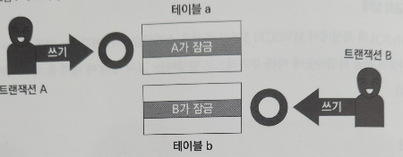
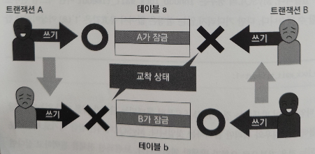

# 트랜잭션과 동시성 제어
## 트랜잭션
- **트랜잭션**은 복수의 쿼리를 일관성있는 한 단위로 취급해야 하며, 이러한 **한 묶음의 쿼리 처리 단위**를 말한다.
- 트랜잭션은 다음 4가지 특성으로 정의되며, ***ACID*** 특성이라고도 불린다.
  - **Atomicity** *(원자성)*
  - **Consistency** *(일관성)*
  - **Isolation** *(고립성 또는 격리성)*
  - **Durability** *(지속성)*

### 원자성 (Atomicity)
- **원자성**은 데이터의 변경 쿼리들이 전부 성공 또는 실패할지를 말한다.
- 예를 들어, 4단계(쿼리)로 묶여진 트랜잭션이 진행 중에 어떠한 이유로 문제가 발생했다면, 처음 상태로 돌아간다. `(ROLLBACK)`
- 만약, 4단계 모두 성공적으로 마무리가 됐다면 `COMMIT`하여 처리를 확정한다.

### 일관성 (Consistency)
- **일관성**은 PK, UK 등의 장치를 이용하여 일련의 데이터 조작 전후에 **그 상태를 유지됨을 보증**하는 것을 말한다.

### 고립성(격리성) (Isolation)
- **고립성**은 데이터 조작을 복수의 사용자가 동시에 실행하더라도 **각각의 처리가 모순 없이** 실행되는 것을 말한다.
  - 모순이 없다는 것은, **복수의 트랜잭션이 순서대로 실행되는 경우 동일한 결과를 얻을 수 있다**는 것을 의미한다.
- 데이터 정합성을 위해 테이블에 `잠금`을 걸어 후속 처리를 `블록`하는 방법이 있다.
  - 잠금 단위에는 테이블 전체, 블록, 행 등이 있는데, MySQL은 트랜잭션 처리에서 주로 행 잠금 기능을 이용한다.

- 이는 DBMS에서 *격리 수준*으로 구현하고 제공하는 것이 **직렬화 가능**이라는 사양이다.
- 하지만, **직렬화 가능의 고립성은 성능면에서 실용적이지 않다.**
- 이 때문에 **직렬화 가능 외에 자신이 아닌 다른 트랜잭션의 영항을 받음을 허용하는 4단계**를 **ANSI**에서 정의했다.
- ***ANSI 격리 수준***
  - **커밋되지 않은 읽기** *(Read Uncommitted)*
  - **커밋된 읽기** *(Read Committed)*
  - **반복 읽기** *(Repeatable Read)*
  - **직렬화 가능** *(Serializable)*
    - 가장 엄격하다.
- 위로 갈수록 완화되어, 커밋되지 않은 읽기가 가장 완화된 격리 수준이다.

- **격리 수준 완화에 따라 일어나는 현상**

| 더티 읽기(Dirty Read)                     | 애매한 읽기(NonRepeatable Read)                          | 팬텀 읽기(Phantom Read)                    |
|---------------------------------------|-----------------------------------------------------|----------------------------------------|
| 어떤 트랜잭션이 커밋되기 전에 다른 트랜잭션에서 데이터를 읽는 현상 | 어떤 트랜잭션이 이전에 읽었던 데이터를 다시 읽을 때, 2회 이후의 결과와 처음과 다른 현상 | 어떤 트랜잭션을 읽을 때 선택 가능한 데이터가 보였다가 사라지는 현상 |

- **위 현상과 격리 수준과의 관계**

| 격리 수준      | 더티 읽기 | 애매한 읽기 | 팬텀 읽기 |
|------------|-------|--------|-------|
| 커밋되지 않은 읽기 | O     | O      | O     |
| 커밋된 읽기     | X     | O      | O     |
| 반복 읽기      | X     | X      | O     |
| 직렬화 가능     | X     | X      | X     |

### 지속성 (Durability)
- **지속성**은 일련의 데이터 조작(*트랜잭션*)을 완료(`COMMIT`)하고 사용자가 받는 조작이 영구적이며, 결과를 잃지 않는 것을 나타낸다. 
- 이는 시스템 정상, 비정상, OS 종료 등의 시스템 장애애도 견딜 수 있다는 의미이기도 하다.
  - MySQL을 비롯해 많은 데이터베이스들은 트랜잭션의 조작을 **하드 디스크에 로그로 저장**하고, 시스템 이상이 발생하면 로그를 사용해 **이상 발생 시점 이전으로 복원이 가능**하다.
  
## 트랜잭션 격리 수준에 따른 외관상 차이
- MySQL은 현재 DBMS의 주류인 **MVCC** 기술을 사용한다.
- MVCC를 사용하며 다음과 같은 특성을 얻는다.  
  - ① 읽기 수행할 경우 갱신 중이라도 블록되지 않는다.
  - ② 읽기 내용은 격리 수준에 따라 바뀔 수 있다.
  - ③ 갱신 시 행 단위로 베타적 잠금을 얻고, 트랜잭션이 종료할 때까지 유지한다.
  - ④ 갱신과 갱신은 나중에 온 트랜잭션이 잠금을 획득하려고 할 때 블록된다.
  - ⑤ 갱신하는 경우 갱신 전 데이터를 UNDO 로그로 *롤백 세그먼트*라는 영역에 유지한다.

### 트랜잭션 격리 수준별 외관
- MySQL 트랜잭션 격리 수준의 기본 설정값은 **반복 읽기**이다.

#### 반복 읽기
- 최초 쿼리 실행 시점에 커밋된 데이터를 읽는다.
- 복수의 쿼리 실행 사이 **다른 트랜잭션이 커밋을 하더라도 그 내용은 반영되지 않는다.**

### 커밋된 읽기
- 최초 쿼리 실행 시점에 커밋된 데이터를 읽는다.
- 복수의 쿼리 실행 사이 **다른 트랜잭션이 커밋을 했다면, 최신 커밋된 데이터를 읽는다.** *(애매한 읽기)*

## 잠금 타임아웃과 교착 상태가 발생하는 이유

### 잠금 타임아웃이란
- **갱신**과 **참조**는 서로를 블록하지 않지만, **갱신**과 **갱신**이 맞물리는 경우엔 뒤늦게 온 갱신이 잠금 대기 상태가 된다. 
- 잠금 해제를 대기하는 쪽에서 잠금을 기다리거나, 기다리지 않거나, 기다린다면 얼마나 기다릴지(초수, 무한) 설정이 가능하다. 
  - MySQL에선 `innodb_lock_wait_timeout`란 시스템 변수로 설정이 가능하다.
    - 기다리지 않는 설정값은 없어 유효값은 최소 `1(초)` 이상이어야 한다.

### 교착 상태란

- 위 상황에서 잠금을 유지한 채, 서로 잠금을 건 자원에 잠금이 필요한 처리(INSERT/UPDATE/DELETE)를 실행하면 **아무리 기다려도 상황이 바뀌지 않는다.**

- 이러한 상황을 **교착 상태**라고 한다.