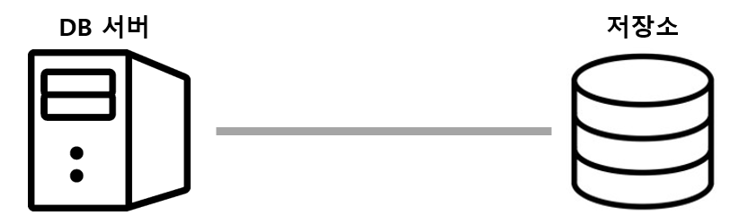
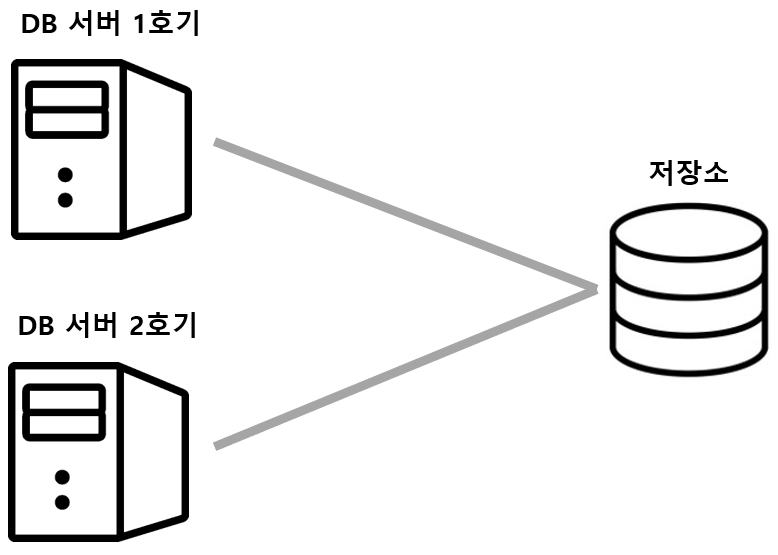
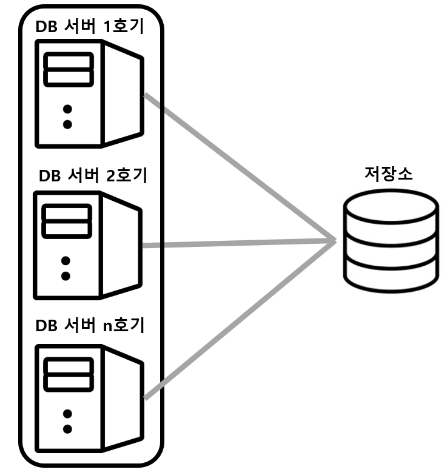
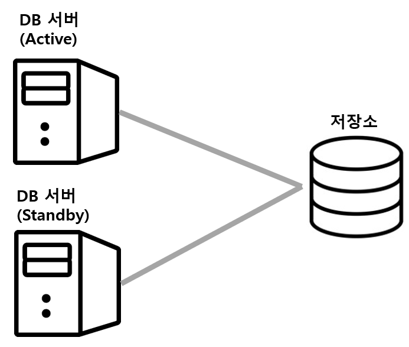

데이터베이스 클러스터링, 리플리케이션, 샤딩에 대해 알아봅니다.

## DB 서버의 다중화 - 클러스터링
- **DB 서버와 저장소의 관계**
  - 
  - 웹 서버나 애플리케이션 서버는 데이터를 일시적으로 보존하는 반면에 데이터베이스는 대량의 데이터를 영구적으로 보존해야 하고, 매체에 필요한 요건이 높아 전용의 외부 저장소를 사용함
  - 따라서 **DB 서버의 아키텍처는 저장소와 묶어서 생각**
  - DB 서버는 영속 계층의 사명으로 다중화 문제를 어렵게 한다.
  - 항상 갱신되는 데이터 사이에서 **다중화를 유지하면서 데이터 정합성**도 의식이 요구됨 
  

- **기본적인 다중화**
  - 
  - DB 서버만 다중화하고 저장소는 하나를 두고 있음
  - 데이터가 보존되는 저장소가 하나라서 정합성을 신경 쓰지 않아도 됨
  - DB 서버가 2대 있지만, 2대가 동시 동작하는 것을 허락할지에 따라 **Active-Active**와 **Active-Standby**로 나뉨
    - **Active-Active** 클러스터를 구성하는 컴포넌트를 동시에 가동
      - 
      - 복수의 DB 서버가 동작하고 있어 한 대가 동작 불능이 되어도 남은 서버가 처리를 계속하고 있어 **시스템 다운을 방지**할 수 있음
      - 복수의 DB **서버의 자원(CPU, Memory)을 사용하여 성능을 향상**시키지만, **저장소가 병목**이 되기 때문에 생각한만큼 성능 향상이 되지 않는 경우도 있음  
    - **Active-Standby** 클러스를 구성하는 컴포넌트 중 실제 가동하는 것은 Active, 남은 것은 대기(Standby)
      - 
      - 보통 Standby 상태의 DB 서버는 사용되지 않다가 Active DB 서버에서 장애가 일어나면 사용됨
      - Standby DB 서버가 Active로 전환되기 까지의 **시간 소모가 있고, 이동안은 시스템 다운 상태**
      - Standby DB는 일정 간격마다 Active DB에 이상이 없는지 조사를 위한 통신(Heartbeat)을 하여 **장애 여부를 조사**
    - **Active-Standby 구성의 종류**
      - **Cold-Standby** 평소에는 Standby DB가 작동하지 않다가 Active DB가 다운된 시점에 작동하는 구성
      - **Hot-Standby** 평소에도 Standby DB가 작동하는 구성
      - Hot Standby가 항상 2대의 DB 서버를 사용하고 있기에 전환 시간이 더 짧지만, 그만큼 비용이 비싸며 실제로 작동하는 것은 Active DB 1대 뿐이기에 사치스러운 구성이라고 볼 수 있음
       
  