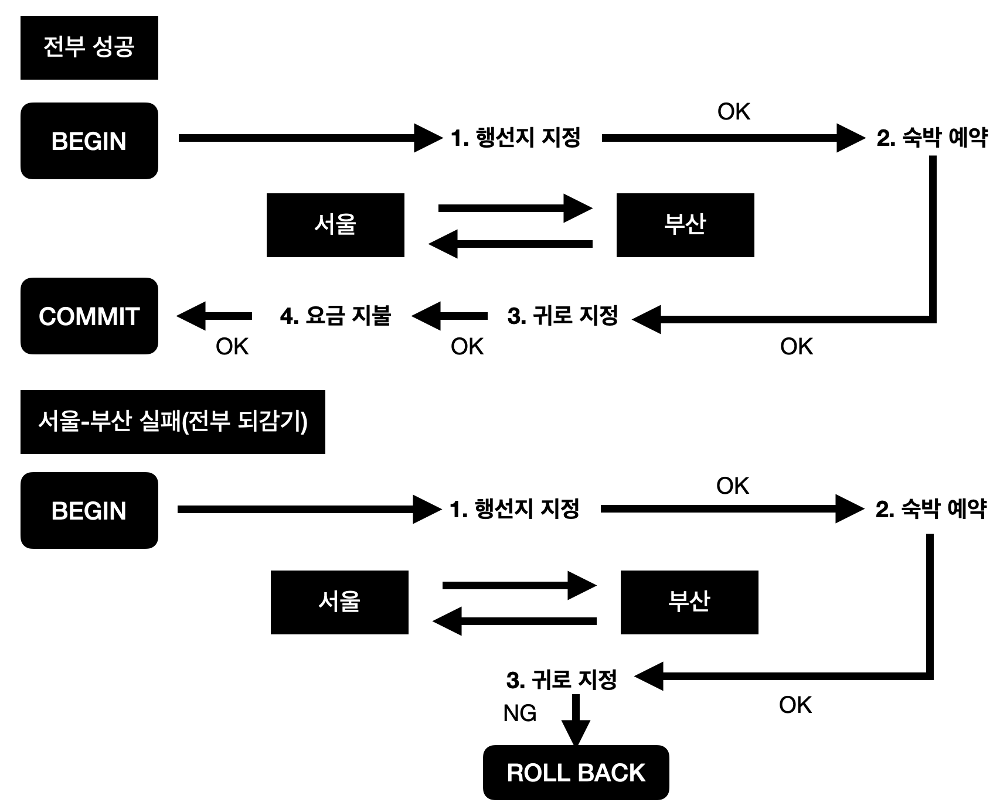

# 트랜잭션과 동시성 제어에 대해

## 트랜잭션이란

테이블 갱신을 수행하기 위해 `INSERT/DELETE/UPDATE`를 사용할 수 있지만, 갱신은 보통 복수의 쿼리를 연속적으로 수행하는 경우가 대부분이다. 
또한, 갱신 전의 데이터로 조회를 할 때 이를 포함한 복수 쿼리들을 일관된 형태의 한 덩어리로 다뤄야 한다. 
즉, **트랜잭션이란 복수 쿼리들을 한 단위로 묶은 단위**이다.      

## ACID에 대해 
트랜잭션은 다음과 같이 4가지 특성으로 정의되며, 앞글자를 따서 **ACID 특성**이라고 한다.

- Atomicity(원자성)
- Consistency(일관성)
- Isolation(고립성 또는 격리성)
- Durability(지속성)

### Atomicity(원자성)
**원자성**이란 데이터 변경을 수반하는 일련의 데이터 조작이 전부 성공할지 전부 실패할지를 보증하는 구조이다.

예를 들어, 서울에서 KTX로 부산까지 가서 일박하고 다음 날 서울로 돌아오는 경우를 가정해 보자. 아마 다음과 같은 순서를 밟을 것이다.

1. 서울 -> 부산행 좌석을 예매한다
2. 부산에서의 숙박을 예약한다
3. 부산 -> 서울행 좌석을 예매한다
4. 1~3의 대금을 지급한다

위 절차가 모두 정상적으로 진행되면 트랜잭션은 `COMMIT를 실행해 처리를 확인한다. 이 경우 각 데이터 조작은 영구적으로 저장되어 결과가 손실되지 않는다.  

만약 처리 도중에 오류가 발생하는 경우는 어떨까?
예를 들어, 3번에서 좌석을 예매할 수 없다든지 4번에서 보유한 돈이 부족한 경우가 있을 수 있다.  
이런 경우에는 `ROLLBACK`을 실행해 1번부터 4번까지의 처리 과정 중 1의 직전 상태까지 되돌아갈 수 있다. 또한, 이렇게 시스템이 정상 동작하는 상황에서의 오류뿐 아니라 클라이언트의 통신 문제나 서버 다운 등의 경우에도 `COMMIT`된 것 외에는 `ROLLBACK`을 해야 한다.

# 참조
- 데이터베이스 첫걸음