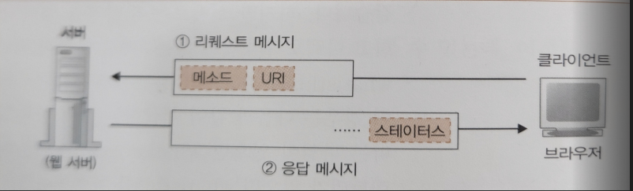

# 웹 브라우저가 메시지를 만든다
## HTTP 리퀘스트 메시지를 작성한다
### 탐험 여행은 URL 입력부터 시작한다
- 탐험 여행의 **출발점은 브라우저에서 URL을 입력하는 것으로 시작**된다.
- URL은 `http://`, `file:`, `mailto:` 등 여러가지가 있다.
- 우리는 `http://` 또는 `https://`의 웹 서버에 액세스하는 경우가 익숙하지만, 브라우저의 기능은 그뿐만이 아니다.
- 파일을 업/다운로드하는 FTP 클라이언트 기능, 메일 클라이언트의 기능 또한 갖고 있기에 **브라우저는 여러 가지의 클라이언트 기능을 갖춘 클라이언트 소프트웨어**로 볼 수 있다.
- URL은 액세스 대상에 따라서 다르게 구성된다.
  - 웹 서버 또는 FTP 서버에 접근하기 위해서는 서버 도메인명이나 접근 할 파일의 경로 등을 URL에 포함시킨다.
  - 메일은 상대 메일 주소를 URL에 포함하거나, 필요 시 사용자명이나 패스워드, 서버 측 포트 번호를 담을 수도 있다.
- 이렇게 **URL은 용도에 따라 다르게 구성**되지만, 모든 URL은 맨 앞에 **액세스 대상**을 나타내는 **프로토콜**을 갖고 있다.
  - 프로토콜은 액세스하는 방법을 나타낸다.
  - 웹 서버에 액세스하기 위해서는 http, 파일 서버는 ftp, 메일은 mailto 등 프로토콜 종류를 URL 맨 앞에 기입해야 한다.
- 각종 URL의 형식

### 브라우저는 먼저 URL을 해독한다.
- 브라우저가 처음 하는 일은 웹 서버로 보내는 리퀘스트 메시지를 작성하기 위해 URL을 해독하는 것이다.

#### 웹 서버 액세스 경우
- 예시 URL: `http://www.google.com/dir/file1.html`
- URL을 해독할 때에 요소들로 따로따로 분해하여 구분한다.
  - `http:`: 액세스 대상이 되는 프로토콜
  - `//`: 뒤로 이어지는 문자열이 서버 이름을 나타냄
  - `www.google.com`: 웹 서버 도메인명
  - `/dir/`: 디렉토리
  - `file1.html`: 액세스 할 파일명
- `www.naver.com` 웹 서버에 dir 디렉토리에 있는 file1.html에 대한 요청을 보낸 것으로 해석이 가능하다.

#### 파일명을 생략한 경우
- 만약 예시 URL에서 마지막이 `/dir/`로 끝나게 된다면 파일명을 쓰지 않고 생략한다는 것이다. (파일명 생략 가능)
- 하지만 파일명이 없다면 서버에서는 어느 파일에 접근을 해야 할지 알 수 없다.
- 따라서 서버에서는 `index.html` 또는 `default.html`이란 파일을 설정하여 파일명이 지정되지 않은 요청의 경우 해당 파일로 접근시킨다.
- URL 끝에 `/`가 생략되어 있다면, 디렉토리명을 생략하는 것이므로 지나친 생략일 수 있지만, 이러한 방법도 인정이 된다.
  - 그냥 기초 설정 파일(index)에 액세스하면 되기 때문이다.
- 다만, `www.google.com/dir` 의 URL은 웹 서버가 dir이란 파일이 있으면 파일명으로 보고, dir이란 디렉토리가 있으면 디렉토리로 해석한다.

### HTTP의 기본 개념
#### 클라이언트의 Request
- 브라우저가 URL을 해독하면, 어디에 접근해야 하는지 판별되고 그 후 브라우저는 HTTP 프로토콜을 사용하여 웹 서버에 접근한다.
- HTTP 프로토콜은 클라이언트에서 서버에 리퀘스트 메시지를 보내며, 그 안에는 **무엇을** 그리고 **어떻게**라는 내용이 쓰여있다.
  - 무엇을: 액세스 대상을 통칭하여 **URI**라고 한다.
  - 어떻게: 요청의 동작을 표현하는 수단인 **메소드(Method)** 이다.
  

#### 웹 서버의 Response
- 웹 서버는 리퀘스트 메시지를 해독하고, 요구에 따라 동작한 뒤 결과 데이터를 응답 메시지에 저장한다.
- 응답 메시지의 맨 앞에는 실행 결과인 `상태 코드`가 있다.
  - 익숙한 상태 코드로는 `200 OK`, `404 Not found`, `403 Forbidden` 등이 있다.
- 그 후 헤더 파일과 데이터가 이어지고, 이 응답 메시지를 클라이언트에게 반송하며 HTTP의 동작은 마무리된다.

#### HTTP Method

- 주로 데이터를 읽을 때 사용하는(조회) `GET` 메서드가 가장 많이 사용된다.
- 다음으로 데이터를 웹 서버에 송신하여 등록하는 경우에 `POST` 메서드를 사용한다.

### HTTP 리퀘스트 메시지를 만든다
- 다시 처음으로 돌아가보자.
- URL을 해독하여 웹 서버와 파일명을 바탕으로 브라우저가 HTTP 리퀘스트 메시지를 만든다.
- HTTP 메시지는 쓰는 방법, 쯕 포맷이 결정되어 있으므로 브라우저는 이 포맷에 따라 리퀘스트 메시지를 만든다.
- 리퀘스트 메시지에서 첫 번째 행은 **리퀘스트 라인**을 쓰는데, 여기서 가장 중요한 것은 맨 앞의 메소드이다.
- 리퀘스트 메시지에서 두 번째 행은 **메시지 헤더**로 날짜, 데이터 종류, 압축 형식, 캐시 정보 등의 요청에 대한 부가적인 메타 정보를 나타낸다.
- 리퀘스트 메시지에서 세 번째 행은 **메시지 본문**으로 메시지의 실제 내용이 된다.
  - 리퀘스트 메시지의 메소드가 GET인 경우에는 메소드와 URI만으로 어떤 요청인지 판단이 가능하므로, 해당 부분은 공백이 된다.
  - 다른 메소드(POST,PUT 등)의 경우 입력한 데이터 등을 메시지 본문에 기입한다.

### 리퀘스트 메시지를 보내면 응답이 되돌아온다
- 응답 메시지 포맷은 기본적으로 리퀘스트 메시지와 같으나, 첫 번째 행이 다르다.
- 요청에 대한 결과를 나타내는 **상태 코드**와 **응답 문구**를 첫 번째 행에 나타낸다.
  - 상태 코드는 숫자이며, 주로 프로그램 등에게 실행 결과를 나타낸다.
  - 응답 문구는 문장이며, 사람에게 실행 결과를 알리는 것이 목적이다.
- 리퀘스트 메시지의 URI는 하나뿐이므로, 여러 개의 파일 등에 대한 요청이 필요할 경우 각각 따로따로 요청해야 한다.

