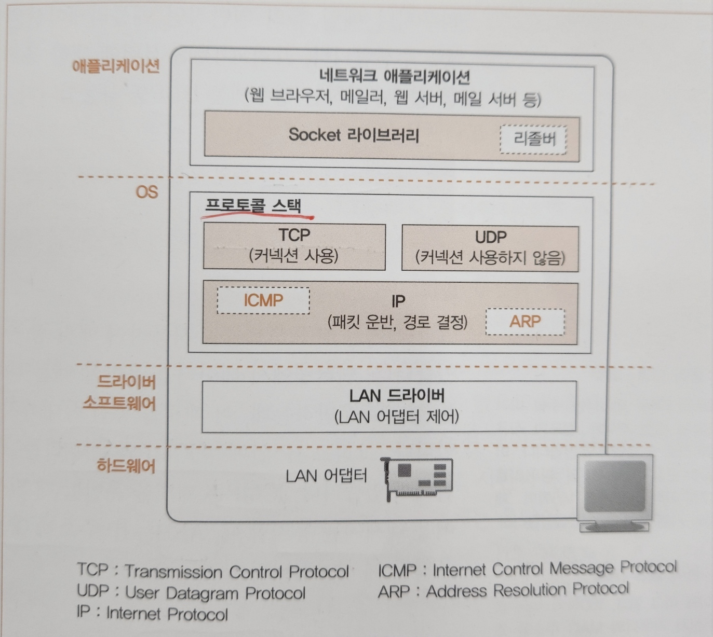

# TCP/IP의 데이터를 전기 신호로 만들어 보낸다
## 1. 소켓을 작성한다
### 프로토콜 스택의 내부 구성

- 위부터 아래로 데이터 송수신의 일을 의뢰한다.
- 가장 위에 네트워크 어플리케이션이 위치해있고 브라우저, 웹 서버, 메일 서버 등이 여기에 해당된다. 
  - 어플리케이션의 아랫부분에는 Socket 라이브러리가 있으며, 이 안에 리졸버가 내장되어 있다.
- OS의 내부에 프로토콜 스택이 있고, TCP/UDP 프로토콜을 사용해 데이터 송수신을 담당하는 부분이 있고, 이 둘이 의뢰를 받아 송수신 동작을 실행한다.
  - TCP: 브라우저나 메일 등에서 사용
  - UDP: DNS 서버 조회 등 짧은 제어용 데이터 송수신의 경우 사용
- IP 프로토콜: 패킷 송수신 동작을 제어
  - 인터넷에서 데이터를 운반할 때는 데이터를 작게 나누어 **패킷** 형태로 운반한다.
  - 이 패킷을 통신 상대까지 운반하는 것이 IP의 주 역할.
  - IP에는 ICMP, ARP 프로토콜을 다루는 부분이 포함됨
    - ICMP: 패킷 운반 중 **발생 오류나 제어용 메시지를 통지**할 때 사용
    - ARP: IP 주소에 대응하는 이더넷의 **MAC 주소**를 조사할 때 사용
- LAN 드라이버: LAN 어댑터의 하드웨어를 제어

### 소켓의 실체는 통신 제어용 제어 정보
- 프로토콜 스택 내부에는 통신 상대 IP 주소, 포트 번호, 통신 동작 상태 등을 **기록하는 메모리 영역을 갖고 있다.**
- 본래 소켓은 실체가 없는 개념적인 것이므로, 이 메모리가 즉 소켓의 실체라고 생각해도 무관하다.
- 프로토콜 스택은 **소켓에 기록된 제어 정보를 참조**하며 수행된다. 

### Socket을 호출했을 때의 동작
- 어플리케이션이 socket을 호출하여 소켓 생성을 의뢰하면, 프로토콜 스택은 한 개의 소켓을 만든다.
- 프로토콜 스택은 소켓 한 개 분량의 메모리 영역을 확보하고 초기 상태라는 것을 기록한다.
- 소켓을 만들면 해당 소켓을 가르키는 **디스크립터**를 어플리케이션에게 알려주며, 디스크립터는 프로토콜 스택 내부의 많은 소켓 중 본인의 소켓 정보를 찾을 수 있는 번호표 같은 정보이다.

## 2. 서버에 접속한다
### 접속의 의미
- 소켓을 만들면 애플리케이션은 connect를 호출하고 나면, 프로토콜 스택이 본인 소켓을 서버측 소켓에 접속을 시도한다.
- 이더넷이나 통신 회선은 항상 케이블이 연결되어 있어 언제나 신호를 보낼 수 있기에 데이터를 신호로 변환해 송신만 하면 언제든 통신이 가능하다.
- 다만, 소켓 생성 직후에 애플리케이션에서 송신 의뢰가 오면 통신을 할 수 없다.
  - 소켓을 만든 직후에는 아무 것도 기록되어 있지 않아 통신 상대를 알 수 없기 때문이다.
  - 때문에 **서버의 IP 주소나 포트 번호를 프로토콜 스택에 알리는 동작이 필요**하고, 이는 접속 동작에서 하나의 역할이기도 하다.
- 접속 동작의 첫 번째 동작은 상대와 제어 정보를 주고받아 소켓에 필요한 정보를 기록하고 데이터 송수신이 가능한 상태로 만드는 것이다.
- 데이터 송수신 동작을 실행하기 위해선 데이터를 일시적으로 담는 **버퍼 메모리**라는 메모리 영역이 필요하다.
- 버퍼 메모리 확보 또한 접속 동작을 할 때 실행된다.

### 맨 앞부분에 제어 정보를 기록한 헤더를 배치한다.
- TCP 헤더에 대한 포맷은 고정되어 있으며, 접속, 송수신, 연결 끊기의 각 단계에서 클라이언트와 서버간의 통신마다(패킷 맨 앞부분에) 이 제어 정보를 부가한다.
- 이더넷이나 IP에도 같은 제어 정보가 있어 용어상 혼란을 야기할 수 있기에 TCP 헤더, IP 헤더, 이더넷 헤더와 같이 명확하게 써야한다.
- 소켓에는 프로토콜 스택의 동작을 제어하기 위한 정보들이 수시로 기록된다.
  - 애플리케이션에서 통지된 정보
  - 통신 상대로부터 받은 정보
  - 송수신 동작의 진행 상황
- 소켓의 제어 정보는 프로토콜 스택의 프로그램과 일체화 되어 있다고 볼 수 있다.

> 통신 동작에 이용하는 제어 정보
> - 헤더에 기입되는 정보
> - 소켓(프로토콜 스택의 메모리 영역)에 기록되는 정보
 
### 접속 동작의 실제
- 애플리케이션의 Socket의 connect를 호출하면, 서버 측 IP 주소와 포트 번호 명령이 프로토콜 스택 내부의 TCP로 전달된다.
- TCP 담당 부분은 IP 주소로 표시된 상대측 서버의 TCP와 제어 정보를 주고받는다.

> 대화 과정
> 1. 데이터 송수신 동작의 개시를 나타내는 제어 정보를 기록한 TCP 헤더를 만든다.
>   - 송신처와 수신처의 포트 번호로 접속하는 소켓을 지정한다.
> 2. TCP 헤더를 IP 담당 부분에 건네어 송신을 의뢰한다.
> 3. IP 담당 부분이 패킷 송신을 실행하고 패킷이 서버에 도착하면 서버측 IP 담당 부분이 TCP 담당 부분에게 건넨다.
> 4. 서버측 TCP 담당 부분이 TCP 헤더를 조사하여 기록된 수신처 포트 번호에 해당하는 소켓을 찾는다.
> 5. 해당되는 소켓을 발견하면 필요한 정보를 기록하고 접속 동작을 진행중 상태로 변경한다.
> 6. 위 과정이 끝나면 서버의 TCP 담당 부분은 응답을 돌려보낸다.
>    - 응답을 보낼 때 패킷을 받은 것을 알리기 위해 ACK 컨트롤 비트를 1로 만든다.