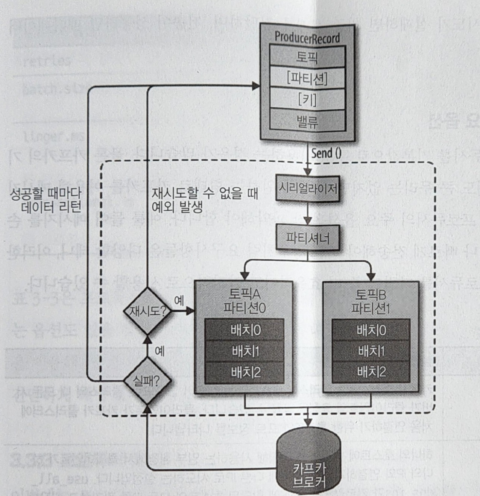

# 카프카 기본 개념과 구조

## 카프카 기초 다지기
### 카프카를 구성하는 주요 요소
- 주키퍼
  - 카프카의 메타데이터 관리 및 브로커의 헬스 체크를 담당한다.
- 카프카 또는 카프카 클러스터
  - 여러 대의 브로커를 구성한 클러스터를 의미한다.
- 브로커
  - 카프카 어플리케이션이 설치된 서버 또는 노드를 말한다.
- 프로듀서
  - 카프카로 메시지를 보내는 역할의 클라이언트.
- 컨슈머
  - 카프카에서 메시지를 꺼내가는 역할의 클라이언트.
- 토픽
  - 카프카는 메시지 피드들을 토픽으로 구분하고, 각 토픽의 이름은 카프카 내에서 고유하다.
- 파티션
  - 병렬 처리 및 고성능을 얻기 위해 하나의 토픽을 여러 개로 나눈 것
- 세그먼트
  - 프로듀서가 전송한 실제 메시지가 브로커의 로컬 디스크에 저장되는 파일을 말한다.
- 메시지 또는 레코드
  - 프로듀서가 브로커로 전송하거나, 컨슈머가 읽어가는 데이터 조각을 말한다.

### 리플리케이션
**리플리케이션**이란 각 메시지들을 복제하여 카프카 클러스터 내 브로커들에 분산시키는 동작을 의미한다. 
이러한 동작으로 하나의 브로커가 종료가 되어도 카프카는 안정성을 유지할 수 있다.

앞에서 `--partition 1`, `--replication-factor 3`의 옵션으로 토픽을 생성하였는데, 이 중에 `replication-factor` 옵션은 카프카 내 몇 개의 리플리케이션을 유지하겠다는 의미이다.
예를 들어 `replication-factor 1`은 리플리케이션이 1개, `replication-factor 3`은 원본을 포함한 리플리케이션이 총 3개라는 의미이다.

안정성을 목적으로 모든 토픽에 대해 각 3개의 리플리케이션으로 설정하였다. *(정확하게는 토픽이 아닌 토픽의 파티션이 리플리케이션 되는 것)*  
하지만, 주의가 필요한 부분은 리플리케이션 팩터 수가 높을 수록 안정성 또한 높아지지만, 그만큼 브로커 리소스를 많이 사용하게 된다.
따라서 복제에 대한 오버헤드를 줄여 브로커를 최대한 효율적으로 사용하는 것을 권장한다.

토픽 생성에 아래와 같은 기준으로 리플리케이션 팩터 수를 설정하면 좀 더 효율적으로 카프카를 운영할 수 있을 것이다.
- **테스트나 개발 환경** : 리플리케이션 팩터 수를 1로 설정
- **운영 환경(로그성 메시지로서 약간의 유실 허용)** : 리플리케이션 팩터 수를 2로 설정
- **운영 환경(유실 허용하지 않음)** : 리플리케이션 팩터 수를 3으로 설정

안정성을 더욱 높이고 싶어서 리플리케이션 팩터 수를 4 또는 5 이상으로 설정하는 경우도 있지만, 리플리케이션 팩터 수 3으로도 충분한 메시지 안정성을 보장하고 디스크 공간을 적절히 사용할 수 있다.
만약 리플리케이션 팩터 수가 3을 초과한다면 그만큼 카프카 내의 동일한 리플리케이션이 존재해 디스크 공간을 많이 사용하게 되므로 이 점을 염두하여 늘려야 한다.

### 파티션
하나의 토픽이 한 번에 처리할 수 있는 한계를 높이기 위해 하나의 토픽을 여러 개로 나눠 병렬 처리가 가능하도록 만든 것을 파티션이라고 한다.
이렇게 하나를 여러 개로 나누면 분산 처리도 가능하며, 나뉜 파티션 수만큼 컨슈머를 연결할 수 있다.

파티션의 수는 토픽을 생성할 때 옵션으로 설정할 수 있는데, 파티션 수를 정하는 기준은 아직까지 다소 모호한 부분이 많다.
각 메시지의 크기나 초당 메시지 건수 등에 다양한 요인에 따라 달라지므로 정확한 예측은 어렵다고 볼 수 있다.

파티션 수는 초기 생성 후 언제든지 확장(늘림)할 수 있지만, 반대로 한 번 늘린 파티션의 수는 절대 줄일 수 없다는 것을 주의하자.
따라서 초기에 토픽 생성 시 파티션 수를 작게, 2 또는 4로 생성한 후, 메시지 처리량이나 컨슈머의 LAG 등을 모니터링하며 점진적으로 늘려나가는 방법이 가장 좋다.
컨슈머의 LAG이란 **(프로듀서가 보낸 메시지 수 - 컨슈머가 가져간 메시지 수)** 를 나타내며, 예시로 프로듀서가 보낸 메시지가 5개이고 컨슈머가 가져간 메시지가 4개라면 5 - 4 = 1이 된다. 만약, 컨슈머가 지연 없이 모든 메시지를 가져갔다면 컨슈머 LAG은 5 - 5 = 0이 된다.

### 세그먼트
프로듀서에 의해 브로커로 전송된 메시지는 토픽의 파티션에 저장되며, 각 메시지들은 **세그먼트라는 로그 파일의 형태로 브로커의 로컬 디스크에 저장**된다.

---
지금까지의 배운 개념으로 카프카 동작 과정을 정리해보자.
1. 프로듀서는 카프카의 peter-overview01 토픽으로 메시지를 전송한다.
2. peter-overview01 토픽은 파티션이 하나뿐이므로, 프로듀서로부터 받은 메시지를 파티션 0의 세그먼트 로그 파일에 저장한다.
3. 브로커의 세그먼트 로그 파일에 저장된 메시지는 컨슈머가 읽어갈 수 있다.
컨슈머는 peter-overview01 토픽을 컨슘해서 해당 토픽 내 파티션0의 세그먼트 로그 파일에서 메시지를 가져온다.

## 카프카의 핵심 개념
카프카가 널리 사용되는 이유는 앞서 봤듯이 높은 처리량, 빠른 응답 속도, 안정성 때문이다.
이번에는 카프카가 이러한 장점을 지니게 된 특성들을 살펴보며 깊이있게 살펴보자.

### 분산 시스템
분산 시스템은 네트워크상에서 연결된 컴퓨터들의 그룹을 말하며, 단일 시스템이 갖지 못한 높은 성능을 목표로 한다.
분산 시스템 성능이 높다는 장점 외에도 하나의 서버 또는 노드 등에서 장애가 발생했을 때, 다른 서버 또는 노드가 대신 처리할 수 있어 장애 대응에 탁월하며, 부하가 높을 경우 시스템 확장에 용이하다는 장점도 있다.

카프카 또한 이러한 분산 시스템이므로 최초 구성한 클러스의 리소스가 한계치에 도달해 더욱 높은 처리량이 필요한 경우, 브로커를 추가하여 확장이 가능하다.
또한, 카프카에서 브로커는 온라인 상태에서 매우 간단하게 추가할 수 있고 최초에는 하나의 카프카 클러스터가 총 3대의 브로커로 운영 중이어도, 갯수의 제한 없이 브로커 수를 확장할 수가 있다.

이렇게 확장이 용이하다는 점은 카프카의 매우 큰 장점이다.

### 페이지 캐시
카프카는 처리량을 높이기 위해 몇 가지 기능을 추가했는데, 그 중 대표적인 것이 바로 **페이지 캐시**이다.
카프카는 OS의 페이지 캐시를 활용하는 방식을 사용하여 디스크에 직접 읽고 쓰는 대신 물리 메모리 중 어플리케이션이 사용하지 않는 일부 잔여 메로리를 활용한다.
이렇게 페이지 캐시를 이용하여 디스크 I/O 접근을 줄여 성능을 높일 수 있다.

다시 말해, 카프카가 OS의 페이지 캐시를 이용한다는 것은 직접 디스크에서 읽고 쓰는 것이 아닌 페이지 캐시를 통해 읽고 쓰는 것이다.

### 배치 전송 처리
카프카는 프로듀서, 컨슈머 클라이언트들과 서로 통신하며 수많은 메시지를 주고받는다.
이 때 발생하는 수많은 통신을 묶어 처리할 수 있다면, 매번 통신하는 것에 비해 네트워크 오버헤드를 줄일 수 있을 뿐 아니라 장기적으로 더욱 빠르고 효율적으로 처리하는 이점을 얻게 된다.

### 압축 전송
카프카는 메시지 전송 시 좀 더 성능이 높은 압축 전송 사용을 권장하며, 지원 중인 압축 타입으로는 gzip, snappy, lz4, zstd 등이 있다.
압축만으로도 네트워크 대역폭이나 회선 비용을 줄일 수 있는데, 배치 전송과 결합해 사용한다면 그 효과는 더욱 높아진다.
파일 하나를 압축하는 것보다 비슷한 파일을 10개 또는 20개로 압축하는 쪽의 압축 효율이 더욱 좋기 때문이다.

압축 타입에 따라 약간의 특성이 달라서 일반적으로 높은 압축률이 필요하다면 gzip, zstd를 권장하고, 빠른 응답 속도가 필요하다면 lz4나 snappy를 권장한다.
메시지 형식이나 크기에 따라 또 다른 결과가 나타날 수 있으니 실제로 메시지를 전송하며 압축 타입별로 테스트를 해보고 결정하는 것이 가장 좋다.

### 토픽, 파티션, 오프셋
카프카는 데이터를 **토픽**에 저장하고, 토픽은 병렬 처리를 위해 여러 개의 **파티션**으로 다시 나눈다.
이 파티션에 메시지가 저장되는 위치를 **오프셋**이라고 하며 오프셋은 순차적으로 증가하는 숫자(64bit 정수) 형태로 되어 있다.
각 파티션의 오프셋은 고유한 숫자이며, 카프카에서 오프셋을 통해 메시지의 순서를 보장하고 컨슈머는 마지막까지 읽은 위치를 알 수도 있다.

### 고가용성 보장
아까 설명했듯이 카프카에서 제공하는 리플리케이션 기능은 토픽 자체를 복제하는 것이 아니라 토픽 내의 파티션을 복제하는 것이라고 했었다.
카프카에서는 원본과 복제된 리플리케이션을 구분하기 위해 **리더**와 **팔로워**라는 용어를 사용한다.
리더는 원본 자체를 의미하며, 리플리케이션 팩터 수가 높아질 수록 리더는 1을 유지하며 팔로워 수만 늘어나게 된다.

이 부분도 아까도 확인했듯이, 무작정 리플리케이션 팩터 수를 높이 잡는 것은 능사가 아니다.
팔로워 수(팩터 수)만큼 브로커의 디스크 공간도 소비되므로 이상적인 팔로워 수를 유지해야 하며, 일반적으로 리플리케이션 팩터 수는 3으로 구성하는 것을 권장한다.

**리더**는 프로듀서, 컨슈머로부터 오는 모든 읽기/쓰기 요청을 처리하며, **팔로워**는 오직 리더로부터 리플리케이션 하게 된다.

### 주키퍼의 의존성
카프카를 언급하며 빼놓을 수 없는 부분이 바로 주키퍼인데, 여럿 아파치 프로젝트인 분산 어플리케이션에서 코디네이터 역할을 하는 어플리케이션으로 사용되고 있다.

주키퍼는 여러 대의 서버를 앙상블(클러스터)로 구성하고, 살아 있는 노드 수가 과반수 이상으로 유지된다면 지속적 서비스가 가능한 구조이기 때문에 따라서 주키퍼는 반드시 홀수로 구성해야 한다.

지노드를 통해 카프카의 메타 정보가 주키퍼에 기록되며, 주키퍼는 이러한 지노드를 이용해 브로커의 노드, 토픽, 컨트롤러 관리 등 매우 중요한 역할을 맡고 있다.
하지만 최근 들어 카프카가 점점 성장하며 주키퍼의 성능 한계가 드러나기 시작했고, 카프카에서 주키퍼에 대한 의존성을 제거하려는 작업이 진행됐고 현재는 주키퍼가 없는 카프카 버전이 릴리즈되었다.
하지만 아직 stable한지는 모르니, 주키퍼를 배제할 순 없지 않을까 생각한다.

카프카의 중요한 메타 데이터를 담고 각 브로커를 관리하는 중요한 역할을 하는 것이 주키퍼라는 것을 알아두자.

## 프로듀서의 기본 동작
### 프로듀서 디자인

- **ProducerRecord**
  - 카프카로 전송하기 위한 데이터 구조
    - 토픽
    - 파티션
    - 키
    - 밸류

프로듀서가 카프카에게 메시지를 보내기 위해선 토픽과 밸류(메시지 내용)이 필수이다.  
반대로, 파티션과 키의 경우 특정 파티션을 지정하기 위함, 레코드를 정렬하기 위함의 선택(옵션) 사항이다.

각 레코드는 시리얼라이저, 파티셔너를 거치며 만약 프로듀서 레코드 옵션인 파티션을 지정했다면 파티셔너는 동작하지 않고 지정된 파티션으로 레코드를 전달한다.  
파티션을 지정하지 않았으면 키를 가지고 파티션을 선택하여 레코드를 전달하는데 기본적으로 라운드 로빈 방식으로 동작한다.  

이렇게 프로듀서 내부에서 send() 동작 이후 메시지들을 모아놨다가 배치로 전송한다.  
전송이 실패하면 지정된 횟수만큼 재시도를 시도하며, 끝까지 실패한다면 최종 실패를 전달하고 전송이 성공하면 메타데이터를 리턴한다.

### 프로듀서의 주요 옵션
대부분 프로듀서를 기본값으로 사용하고 기본으로 사용해도 큰 문제는 없지만, 자신이 원하는 형태로 메시지를 전송하기 위해선 프로듀서의 주요 옵션을 잘 파악해야 한다.  
또한, 요구사항은 다양하고 지속적으로 변경되므로 프로듀서 옵션을 파악하고 있으면 효율적이고 안정적인 운용을 할 수가 있다.

- `bootstrap.servers`
  - 카프카 클러스터는 클러스터 마스터란 개념이 없기에, 클러스터 내의 모든 서버가 클라이언트의 요청을 받을 수 있다.  따라서 클라이언트가 카프카 클러스터에 처음 연결하기 위한 호스트와 포트 정보를 나타낸다.
- `client.dns.lookup`
  - 하나의 호스트에 여러 IP를 매핑해 사용하는 일부 환경에서 클라이언트가 하나의 IP와 연결되지 못할 경우 다른 IP로 시도하는 설정이다.
- `acks`
  - 프로듀서가 카프카 토픽 리터에 메시지를 전송한 뒤, 요청을 완료하기를 결정하는 옵션
    - 0 : 빠른 전송, 일부 메시지 손실 가능성 있음.
    - 1(기본) : 리더가 메시지를 받았는지 확인하지만, 모든 팔로워를 확진하지는 않음.
    - -1(all) : 팔로워가 메시지를 받았는지 확인함. 느림.
- `buffer.memory`
  - 프로듀서가 카프카 서버로 데이터를 보내기 위해 잠시 대기(배치)할 수 있는 메전체 메모리 바이트.
- `compression.type`
  - 프로듀서가 메시지 전송 시 선택할 수 있는 압축 타입.
- `enable.idempotence`
  - true 시 중복 없는 전송이 가능함.
    - max.in.flight.requests.per.connection은 5 이하, retries는 0 이상, acks는 all로 설정해야 함.
- `max.in.flight.requests.per.connection`
  - 하나의 커넥션에서 프로듀서가 최대한 ACK 없이 전송할 수 있는 요청의 수
    - 메시지 순서가 중요하다면 1로 설정을 권장하나, 성능이 다소 떨어질 수 있음.
- `retries`
  - 전송에 실패한 데이터를 다시 보내는 횟수
- `batch.size`
  - 배치 크기
- `linger.ms`
  - 배치 형태 메시지를 보내기 전에 추가 메시지를 기다리는 시간을 조정하고, 배치 크기에 도달하지 못한 상황에서 해당 옵션 시간에 도달했을 때 메시지를 전송.
- `transactional.id`
  - `정확히 한 번 전송'을 위해 사용하는 옵션이며, 동일한 TransactionalId에 한해서 정확히 한 번을 보장한다.
    - enable.idempotence가 true여야한다.

## 컨슈머의 기본 동작
컨슈머는 카프카 토픽의 메시지를 가져오는 역할을 한다.  
컨슈머가 단순히 카프카의 메시지를 가져오는 것 같지만, 내부적으로 컨슈머 그룹, 리밸런싱 등 여러 가지 동작이 수행된다.  
프로듀서가 아무리 빠르게 카프카로 메시지를 전송하더라도, 컨슈머가 토픽의 메시지를 빠르게 읽어오지 못한다면 결국 지연으로 이어진다.  
이처럼 컨슈머의 역할 또한 매우 중요하므로 동작들에 대해 잘 이해하고 있어야 한다.

파티션 수와 컨슈머 수는 일대일이 이상적이다.  
파티션 수보다 컨슈머 수가 많으면 성능이 높아지는 것이 아니라, 남는 컨슈머들은 대기 상태로만 존재한다.  

### 컨슈머의 주요 옵션
컨슈머 또한 프로듀서와 마찬가지로 다양한 옵션을 제공한다.  
카프카에 메시지가 잘 저장되어 있어도 관리자가 컨슈머를 어떻게 처리하고 다루는지에 따라 메시지 중복, 유실 등 여러가지 상황이 발생 가능하다.  
컨슈머의 옵션을 잘 이해하고 사용해야 최대한 안정적이고 지연이 없도록 사용할 수 있다.

- `bootstrap.servers`
  - 브로커의 정보를 입력.
- `fetch.min.bytes`
  - 한 번에 가져올 수 있는 최소 데이터의 크기. 지정 크기보다 적다면 요청에 응답하지 않고 데이터가 누적되기를 기다린다.
- `group.id`
  - 컨슈머 그룹 식별자. 동일한 그룹의 컨슈머는 정보를 모두 공유한다.
- `heartbeat.interval.ms`
  - 하트비트가 있다면 컨슈머 상태가 active를 의미한다. 일반적으로 session.timeout.ms의 1/3으로 설정한다.
- `max.partition.fetch.bytes`
  - 파티션당 가져올 수 있는 최대 크기를 의미한다.
- `session.timeout.ms`
  - 이 시간으로 컨슈머가 종료된 것인지 판단한다.
  - 컨슈머는 주기적으로 하트비트를 보내야하고, 해당 옵션 시간까지 하트비트가 오지 않는다면 컨슈머 종료로 간주하고 그룹에서 제외하며 리밸런싱을 시작한다.
- `enable.auto.commit`
  - 백그라운드로 주기적으로 오프셋을 커밋한다.
- `auto.offset.reset`
  - 카프카에서 초기 오프셋이 없거나 현재 오프셋이 더 이상 존재하지 않다면 다음의 옵션으로 reset 한다.
    - earliest : 가장 초기의 오프셋 값으로 설정한다.
    - latest : 가장 마지막의 오프셋 값으로 설정한다.
    - none : 이전 오프셋 값을 찾지 못하면 에러를 나타낸다.
- `fetch.max.bytes`
  - 한 번 가져오기 요청으로 최대 가져올 수 있는 최대의 크기이다.
- `group.instance.id`
  - 컨슈머의 고유한 식별이다.
    - 설정 시 static 멤버로 간주되어 불필요한 리밸런싱을 하지 않는다.
- `isolation.level`
  - 트랜잭션 컨슈머에 사용되는 옵션이다.
    - read_uncommitted : 기본값으로 모든 메시지를 읽음.
    - read_committed : 트랜잭션이 완료된 메시지만 읽음.
- `max.poll.records`
  - 한 번의 poll() 요청으로 가져오는 최대 메시지 수.
- `partition.assigment.strategy`
  - 파티션 할당 전략이며, 기본값은 range.
- `fetch.max.wait.ms`
  - 해당 시간보다 적은 경우 요청에 대한 응답을 기다리는 최대 시간

컨슈머에서 메시지를 가져오는 방식은 크게 세 가지 방식이 있다.
- 오토 커밋
  - 오프셋을 주기적으로 커밋하므로 관리자가 오프셋을 관리하지 않아도 되지만, 컨슈머 종료 등이 빈번하면 메시지 유실 또는 중복으로 가져올 수 있음.
  - 카프카가 굉장히 안정적으로 잘 동작하고, 컨슈머 역시 자주 변경되거나 종료되지 않으므로 오토커밋을 주로 사용함.
- 동기 가져오기
  - 오토 커밋과 달리 poll()로 메시지를 가져온 후 처리까지 완료하고 현재 오프셋을 커밋함.
  - 속도는 느리지만 메시지 손실이 거의 발생하지 않아 중요한 처리 작업에 용이함.
- 비동기 가져오기
  - `commitAsync()` 오프셋 커밋을 실패하더라도 재시도하지 않는다.
  
### 컨슈머 그룹의 이해
컨슈머는 컨슈머 그룹에 속한 것이 일반적인 구조이며, 하나의 컨슈머 그룹 안에 여러 개의 컨슈머가 구성될 수 있다.  
컨슈머 그룹 내의 컨슈머들은 토픽 내의 파티션과 일대일 매핑 구조로 메시지를 가져온다.  
