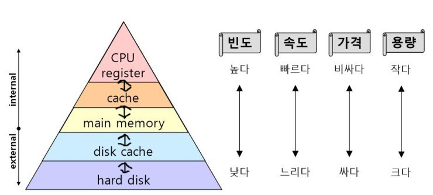

# 컴퓨터 시스템의 동작 원리
## 컴퓨터 시스템의 구조
컴퓨터 시스템은 내부장치인 CPU, 메모리와 외부장치인 디스크, 키보드, 마우스 등으로 구성된다.
외부 장치에서 내부 장치로 데이터를 읽어와 각종 연산을 수행한 후 결과를 외부 장치로 다시 내보내는 방식이다.
이때 컴퓨터 내부로 데이터가 들어오는 것을 입력(Input)이라고 하고, 외부장치로 데이터가 나가는 것을 출력(output)이라고 한다.

운영체제는 부팅 때부터 항상 메모리에 올라가있지만, 운영체제의 모든 부분이 다 메모리에 상주하고 있다면 낭비가 발생하게 된다.
따라서 운영체제 중 항상 메모리에 올라가 있는 부분은 운영체제의 핵심적 부분에 한정되며, 이 부분을 **커널**이라고 한다.

## CPU 연산과 I/O 연산
각 장치의 컨트롤러마다 출입 데이터를 임시로 저장하기 위한 작은 메모리를 갖고 있는데, 이를 **로컬버퍼**라고 부른다.
외부장치에서 데이터를 읽어오는 경우, 우선 로컬버퍼에 데이터를 임시로 저장한 뒤에 메모리에 전달한다.

로컬버퍼로 읽어오는 작업이 끝났는지는 CPU가 지속적으로 체크하는 것이 아니라 장치의 컨트롤러가 인터럽트를 발생시켜 CPU에 알린다.
기본적으로 CPU는 매 시점 메모리에서 명령을 하나씩 읽어서 수행하는데, 옆에 인터럽트 라인이 있어 작업 중간에 인터럽트 라인에 신호가 들어오면 인터럽트 관련된 일을 우선하여 처리한다.

즉, CPU는 명령 하나를 수행할 때마다 인터럽트를 확인하고 발생했다면 다음 명령 수행 이전에 인터럽트를 먼저 처리하는 것이다.

## 인터럽트의 일반적 기능
운영체제는 각종 하드웨어 및 소프트웨어 자원 관리뿐 아니라 사용자 프로그램에게 필요한 서비스도 미리 프로그래밍하여 커널 내에 포함시킨다.

## 인터럽트 핸들링
**인터럽트 핸들링**이란 인터럽트가 발생한 경우 처리해야 할 일의 절차를 의미한다.
프로그램이 실행되는 도중에 인터럽트가 발생하면 해당 프로그램의 상태(메모리 주소 등 부가적인 정보)를 먼저 저장한다.
CPU에서 명령이 실행될 때에는 CPU 내부의 임시 기억장치인 레지스터에서 데이터를 읽거나 쓰면서 작업을 하는데, 이때 인터럽트가 발생해 새로운 명령을 실행하게 된다면 기존 레지스터 값들이 모두 지워지게
되므로 CPU 내에 상태를 저장해두어야 인터럽트 처리가 이루어질 수 있다.

운영체제는 현재 시스템 내 실행 중인 프로그램들을 관리하기 위해 **프로세스 제어블록(PCB, Process Control Block)** 라는 자료구조를 둔다.
PCB는 각 프로그램 마다 존재하며 해당 프로그램의 어느 부분이 실행 중이었는지, 코드의 메모리 주소와 레지스터 값, 하드웨어 상태 등을 저장한다.
예로 어떤 프로그램이 실행 도중에 인터럽트가 발생하면 해당 프로그램 실행 상태를 PCB에 저장한 후 CPU의 제어권은 인터럽트 처리루틴으로 넘어가게 되며,
인터럽트 처리가 끝나면 저장된 상태를 PCB로부터 읽어 CPU상으로 복원해 인터럽트 당하기 직전 위치부터 실행이 이어지게 된다.

## 입출력 구조
운영체제는 프로그램을 몇 가지 상태로 나누고 입출력 중인 프로그램의 경우 **봉쇄 상태**로 전환시키는데, 이는 프로그램에게 CPU를 할당하지 않고, CPU 할당 시 곧바로 명령을 수행할 수 있는 프로그램에게만 CPU를 할당한다는 것을 의미한다.

입출력 방식에는 동기식 입출력과 비동기식 입출력이 있다.

동기식 입출력을 요청한 프로그램은 입출력이 완료될 때까지 다음 명령을 수행할 수 없기에 그동안 CPU가 낭비되며 다른 프로그램에게 CPU를 양도하지 않고 입출력 연산이 완료될 때까지 기다린다면 매 시점 하나의 입출력 연산만이 일어날 수 있다.
그러나, 입출력 수행 중에 다른 프로그램에게 CPU를 양도하면 동시에 다수의 입출력 연산을 일어날 수 있기에 이처럼 다수의 프로그램이 동시에 입출력을 요청하는 경우 **동기성**을 보장하기 위해 장치마다 큐를 두어 요청된 순서대로 처리할 수 있도록 한다.

비동기식 입출력은 입출력 연산 요청 후 연산을 끝나기를 기다리는 것이 아닌 CPU의 제어권을 입출력 연산을 호출한 프로그램에게 곧바로 다시 부여하는 방식이다.

### 입출력 비교
I/O 요청 시 **동기식 입출력은** 먼저 운영체제의 커널에게 CPU의 제어권이 넘어와서 입출력 처리와 관련된 커널의 코드가 수행된다.
이 때, 입출력을 호출한 프로세스의 상태를 봉쇄 상태로 하여 입출력이 완료되기 전까지 CPU를 할당받지 못하도록 하고, 입출력 완료되면 I/O 컨트롤러가 CPU에게 인터럽트를 발생시켜 입출력이 완료되었음을 알려준다.
그 후에 해당 프로세스의 봉쇄 상태를 해제시켜 CPU를 할당받을 수 있는 권한을 생기게 한다.

반면에 **비동기식 입출력**에서는 CPU의 제어권을 입출력을 요청한 프로세스에게 곧바로 주어지며, 입출력 연산 완료와 무관하게 처리 가능한 작업부터 시작한다.
동기식 입출력과 마찬가지로 입출력 연산이 완료되면 인터럽트를 통해 CPU에게 알려준다.

### DMA
원칙적으로 메모리는 CPU에 의해서만 접근할 수 있는 장치이며, CPU 외 장치가 메모리 데이터에 접근하기 위해서는 CPU에게 인터럽트를 발생시켜 CPU가 이를 대행하는 방식으로만 가능하다.
모든 메모리 접근 연산을 CPU에 의해서만 이뤄진다면 효율성이 떨어지는데, 이를 극복하기 위해 CPU 외에 메모리 접근이 가능한 장치를 하나 더 두는 경우가 많다.
이와 같은 장치를 **DMA(Direct Memory Access)** 라고 하며, DMA는 일종의 컨트롤러로서 CPU가 입출력 장치들의 메모리 접근 요청에 의해 자주 인터럽트 당하는 것을 막아주는 역할을 한다.

컨트롤러가 인터럽트를 발생시키면 CPU가 로컬버퍼에서 메모리로 읽어오는 작업을 했던 것을 DMA가 대행함으로써, CPU는 인터럽트를 처리할 필요가 없어 효율성이 높아진다.
이 때, DMA는 바이트 단위가 아니라 블록이라는 더 큰 단위로 정보를 메모리로 읽어온 후에 CPU에게 인터럽트를 발생시켜 작업 완료를 알린다.

이런식으로 DMA라는 중개자를 두어 인터럽트 발생 빈도를 줄이고 CPU를 보다 효율적으로 관리하며 입출력 연산을 빠르게 수행할 수가 있다.

### 저장장치의 구조
컴퓨터 시스템을 구성하는 저장장치는 **주기억장치**와 **보조기억장치**로 나뉜다.

주기억장치는 보통 메모리라고 하며 전원이 종료되면 갖고 있던 데이터가 모두 사라지는 **휘발성**의 RAM을 매체로 사용하는 경우가 대부분이다.
반대로 보조기억장치는 전원이 종료되어도 데이터가 유실되지 않는 **비휘발성**의 마그네틱 디스크를 주로 사용한다.

보조기억장치의 용도는 크게 두 가지로 나뉜다.
- 파일 시스템 용도로 시스템이 종료되어도 유지해야 할 정보가 있으면 파일 형태로 보조기억장치에 저장한다.
- 메모리의 연장 공간인 **스왑 영역** 용도이다. 메모리는 크기가 한정적이고 가격이 비싸면서 용량이 적으므로 다수의 프로그램이 메모리에 다 올라가 동시에 수행되는 것은 한계가 있다. 때문에 운영체제는 프로그램 수행에 당장 필요한 부분만 메모리에 올려놓고 그 외 부분은 디스크의 스왑 영역에 내려놓는다. 이러한 과정을 **스왑 아웃** 한다고 하며, 스왑 아웃된 부분이 필요하다면 다시 메모리 영역으로 올린다.

### 저장장치의 계층 구조

저장장치는 빠른 저장장치부터 느린 저장장치까지 단계적인 계층 구조로 이루어진다.
저장장치의 속도가 빠를 수록 가격이 높고 용량이 적으며, 반대로 속도가 느릴 수록 가격이 싸고 용량이 크다.
따라서 빠르게 필요한 정보일수록 빠른 저장장치에 보관하여 수행 속도를 높이고, 그렇지 않은 정보는 상대적으로 느린 저장장치에 보관한다.

상위에 보이는 CPU Register, Cache Memory, Main Memory 는 휘발성 저장장치로 구분되며 앞서 봤듯이 전원이 종료되면 데이터가 모두 사라진다.
반대로 아래 저장장치들은 비휘발성이므로 데이터가 유지된다.

**캐시 메모리**는 메인 메모리보다 비용이 비싸지만, 여러 가지의 캐싱 기법을 활용하여 메인 메모리보다 성능면에서 효율적으로 활용할 수 있다.
**캐싱 기법**이란 상대적으로 용량이 적은 빠른 저장장치를 이용해 느린 저장장치의 성능을 향상시키는 기법을 말한다. 
캐싱 기법은 상대적으로 느린 저장장치의 내용을 빠르게 활용하거나 자주 사용해야 할 때, 빠른 저장장치에 선별적으로 저장함으로써 두 저장장치 사이의 속도를 완충시킨다. 
캐싱 기법을 다양한 저장장치 계층 내에서 활용함으로써 적은 용량의 상위 저장장치만으로도 빠른 수행 속도를 얻어낼 수가 있다.

### 하드웨어의 보안
운영체제는 다중 프로그래밍 환경에서 동작하므로 프로그램 사이에 실행을 방해하거나 충돌을 일으키는 문제를 막기 위해 하드웨어에 대한 보안 기법이 필요하다.
 운영체제는 하드웨어적 보안을 유지하기 위해 기본적으로 **커널모드**와 **사용자모드** 두 가지 모드를 지원한다.
 중요한 정보에 접근해야 하는 연산은 커널모드에서만 실행할 수 있도록 하여 일반 사용자가 직접 위험한 명령을 수행할 수 없도록 하고, 그렇지 않은 일반적인 연산은 사용자 모드에서 사용자가 수행하도록 하여 보안을 확보한다.

컴퓨터 시스템은 CPU 내부에 **모드비트**를 두어 사용자 프로그램을 감시한다. 모드비트가 0이면 커널모드로서 모든 명령을 수행할 수 있고, 모드비트가 1이면 사용자모드로서 제한된 명령만을 수행할 수 있다.
CPU는 보안과 관련된 명령을 수행하기 전에 항상 모드비트를 조사하여 값이 0일 경우에만 해당 명령을 수행한다.

### 메모리 보안
메모리 또한 프로그램이 동시에 실행되므로 각 영역을 침범을 막기 위해 보안이 필요하다. 
2개의 레지스터를 사용하여 프로그램이 접근하려는 메모리 부분이 합법적인지 체크함으로써 메모리를 보호할 수 있는데, 2개의 레지스터는 **기준 레지스터**와 **한계 레지스터**이다.

### CPU 보호
특정 프로그램이 CPU를 독점하여 무한반복을 수행하는 등 부적하게 CPU 사용 권한을 독점하고 있다면 다른 프로그램이나 운영체제가 CPU를 빼앗을 방법이 없게 된다. 
이와 같이 CPU는 독점을 방지하기 위해 **타이머**라는 하드웨어를 사용하고, 타이머는 정해진 시간이 지나면 인터럽트를 발생시켜 운영체제가 CPU의 제어권을 획득할 수 있도록 하는 역할을 수행한다.
타이머는 일정한 시간 단위로 세팅될 수 있으며 매 순간마다 1씩 감소하고 0이 되는 순간 인터럽트를 발생시킨다.

한편 타이머는 시분할 시스템에서 현재 시간을 계산하기 위해서도 사용되며, **시분할 시스템**은 여러 프로그램이 CPU의 시간을 조금씩 나누어 사용하는 시스템을 의미하고 대부분의 컴퓨터가 시분할 시스템에 해당된다.

### 시스템 콜을 이용한 입출력 수행
I/O 명령은 특권명령인 입출력 명령에 해당하므로 사용자 프로그램이 직접 수행할 수 없고, 이러한 명령들은 운영체제 코드에 구현되어 있다.
사용자 프로그램은 직접 수행하는 대신에 운영체제에게 **시스템 콜**이라는 서비스 대행 요청을 하여 입출력을 수행한다. 
**시스템 콜은** 일종의 소프트웨어적인 인터럽트로서 트랩이 발생하여 CPU의 제어권이 운영체제로 넘어가게 되는 것이다. 
예를 들어 시스템 콜이 디스크 입출력 요청이라면 디스크 컨트롤러에게 입출력 요청을 수행하도록 명령을 내리고, 추후 해당 컨트롤러가 수행을 마치면 CPU에게 인터럽트를 발생시켜 입출력이 완료되었음을 알림으로써 해당 프로그램이 다시 CPU를 할당받을 수 있도록 한다.