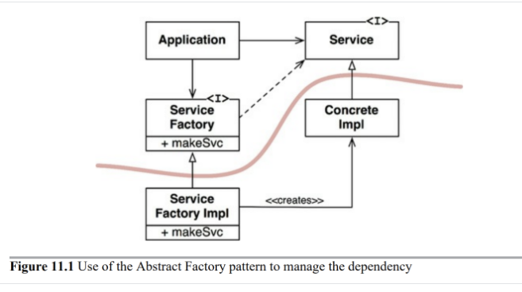

# 11. DIP: 의존성 역전 원칙

DIP에서 말하는 유연성이 극대화된 시스템이란 소스 코드 의존성이 추상에 의존하며 구체에는 의존하지 않는 시스템이다.

하지만 소프트웨어 시스템은 구체적인 많은 장치에 의존하기 때문에 비현실적인 말로 다가온다.

다만, 여기서부터는 이제 변경될 일이 거의 없고, 있더라도 엄격하게 통제되는 클래스와 개발 중과 같은 변동성이 큰 구체 클래스로 구분을 짓는다.

DIP를 논할 때는 운영체제나 플랫폼 같이 안정성이 보장된 환경에 대해서는 용남하는 편이다. 다시 말해, 변경되지 않는다면 구체에 의존할 수 있다.

다만, 이제 우리가 의존하지 않으려고 하는 것은 변동성이 큰 구체 클래스이다.

### 안정화된 추상화

- 인터페이스가 변경되면 이를 구현한 구체 클래스들도 수정되어야 하고, 반대로 구현체에 변경이 생긴다면 인터페이스는 대부분 변경될 필요가 없다.
    - 즉, 인터페이스가 구현체보다 변동성이 낮다.
- 안정된 소프트웨어 아키텍처는 변동성이 큰 구현체에 의존하는 일을 지양하고, 안정된 인터페이스를 선호한다.

### 팩토리

- 여기서 곡선은 아키텍처의 경계를 의미한다.
- 이 곡선은 구체적인 것들로부터 추상적인 것들을 분리한다.
- 곡선을 경계로 두 가지 컴포넌트로 분리한다.
    - 추상 컴포넌트: 애플리케이션의 모든 고수준 업무 규칙을 포함
    - 구체 컴포넌트: 업무 규칙을 다루기 위해 필요한 모든 세부사항
- 해당 곡선과 교차되는 부분에서는 의존성이 모두 추상을 향하는 것을 볼 수 있다.
    - 다시 말해, 소스 코드 의존성이 제어흐름과 반대로 역전되는 모습인데, 이를 의존성 역전이라고 부른다.

### 구체 컴포넌트

- 구체 컴포넌트에는 구체적인 의존성이 있어 DIP에 위배되지만, 이는 일반적인 모습이다.
- DIP 위배를 모두 없앨 수는 없지만, DIP를 위배하는 클래스들을 적은 수의 구체 컴포넌트 내부로 모을 수 있고, 격리할 수 있다.