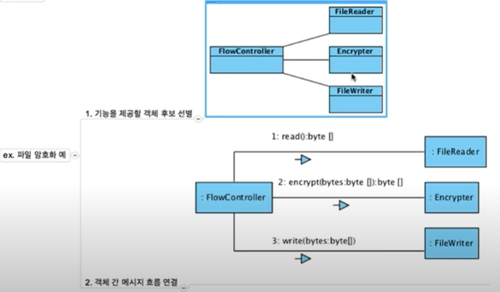
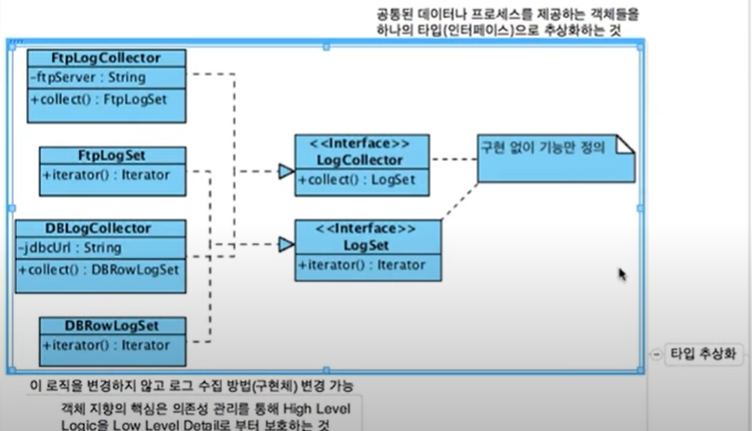

# OOP

### 왜 깨끗한 코드를 작성해야 하는가
읽기 쉬운 코드 작성에 노력을 쏟아야 한다.

소프트웨어 생명주기에서 유지보수가 차지하는 시간은 상당하고, 우리는 이 유지보수에 쏟는 비용을 최소화 해야하고 첫번째 발걸음은 클린코드이다.

클린코드, 디자인 패턴, TDD 등으로 소프트웨어 디자인을 최대한 잘 해야하는 이유는 소프트웨어의 생명주기는 대부분 유지보수에 있으며, 좋은 아키텍처 또는 디자인의 소프트웨어는 이 유지보수 발생 비용을 낮춰준다.


### 절차지향
절차지향은 하나의 Data 변경이 많은 영향을 미치게 되면서 Data 변경이 어려워짐.

모든 프로시저가 데이터를 공유

요구사항 변경이 데이터 구조 변경을 유발함.

### 객체지향
데이터와 그 데이터를 조작하는 코드의 변경은 외부에 영향을 미치지 않음.

외부에 노출된 인터페이스만 변경되지 않는다면 프로시저를 실행하는데 필요한 만큼의 데이터만 가짐.

인터페이스를 잘 준수하고 충분한 추상화가 이뤄지고 있다면 구현 변경에 유연함.

### 절차지향, 객체지향 차이
절차지향 : 난이도 비교적 쉬움. 코드들이 데이터를 공유함. 유지보수에 어려움.

객체지향 : 난이도 비교적 어려움. 설계 및 코딩에 상대적으로 오래걸림. 

소프트웨어는 사용된다면 요구사항은 계속 변한다.<br/>
절차지향이 처음에는 쉬울지 모르나 시간이 지나면 수정하기 어려운 구조가 된다.

## 객체지향 설계 과정
1. 기능을 제공할 객체 후보 선별
   - 내부에서 필요한 데이터 선별
    - 클래스 다이어그램
    - 정적 설계
    
2. 객체 간 메시지 흐름 연결
    - 커뮤니케이션 다이어그램
    - 시퀀스 다이어그램
    - 동적 설계
    


### 캡슐화

인터페이스를 통해 메세지 흐름 연결, 내부 구현은 감춰 클라이언트 코드에 영향을 미치지 않도록 설계 (=캡슐화)

객체의 상태가 아닌 행동(메시지)를 제공하자. (=무분별한 Getter/Setter을 자제하자.(반성..))

Ex
```java
public class Timer {
    private int expiredDate;

    public boolean isExpired() {
        return System.currentMillis() < this.expiredDate;
    }
}
```

### 추상화

로직 변경 없이 로그 수집 방법(구현체) 변경 가능

변경 대처에 유연해진다

클라이언트에게 인터페이스를 제공하여 변경에 유연하게 대처할 수 있도록 하자.
(= 구현체를 직접 제공하는 것이 아닌 인터페이스를 제공하면 요구사항 변경 시 그에 맞는 구현체로만 갈아끼우면 됨)



### 다형성

다형성은 다양한 형태를 가질 수 있는 성질이다.
```
ZetMotercycle zm = new ZetMotorcycle();

Motorycle mc = zm;
ZetEngine ze = zm;
```

