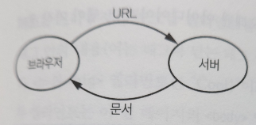
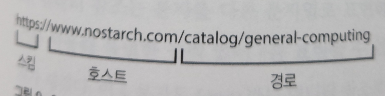

# 웹 브라우저

웹 브라우저 자체가 **가상 머신**이며, 아주 복잡한 명령어 집합을 완전히 소프트웨어로 구현한 컴퓨터, 즉 **인터프리터**에 속한다.  
브라우저는 크고 복잡한 어플리케이션임과 동시에 **개발자 콘솔**를 통해 프로그래밍을 할 수 있다.

## 균일 자원 위치 지정자
브라우저는 **균일 자원 위치 저장자** *(URL, Uniform Resource Locator)* 을 사용해 HTTP 프로토콜을 통해 서버에서 문서를 요청한다.  
서버는 문서를 브라우저에게 보내고, 브라우저는 그 문서를 표시해준다.

  
이렇게 브라우저에서 URL을 통해 서버에 문서를 요청하고, 서버에서는 문서를 브라우저에게 제공해주는 것을 알 수 있다.  

  
- 스킴
  - 통신 매커니즘, 프로토콜
- 호스트
  - 통신하려는 서버를 뜻한다. IP 주소일 수 있지만, 보통 도메인 이름을 사용
- 경로
  - 가르키는 위치에서 추출

## HTML 문서
HTML은 웹 페이지 등 다른 대상에 대한 링크가 들어 있는 텍스트란 의미의 **하이퍼텍스트(hypertext)** 를 활용한다.  
HTML에서 부등호(<)는 특별한 텩할을 하며, 이 부동호를 **엘리먼트**라고 부른다.  
`<title></title>`, `<p></p>` 처럼 엘리먼트 마다의 각자 역할을 갖고 있다.  

HTML에는 엘리먼트의 역할을 빼앗을 수 있는 문자를 다른 문자열로 표현하는 방법인 **엔티티 참조**가 존재한다.  
예로 HTML 내에서 `&lt;`, `&amp;`를 사용하면 < 와 &로 HTML에 표현된다. 

**어트리뷰트**란 태그 내에 속성값을 표현하는 옵션이다.
```html
<tag name="value1" id="abc">
  내용
</tag>
```
이렇게 태그 내에서 속성값으로 key-value로 쌍을 이루는 것을 어트리뷰트라고 한다.

## DOM: 문서 객체 모델
웹 브라우저는 문서를 **문서 객체 모델(DOM, Document Object Model)** 에 따라 처리한다.

### DOM 처리
브라우저는 문서 트리로 **깊이 우선 순회**하여 트리를 해석한다.  
루트에서 시작하여 첫 번째 자식으로 내려가고, 그 이후로 게속 종단 노드에 도달하기까지 순회를 계속한다.  
이러한 과정을 모든 노드를 방문할 때까지 반복하며, 여기서 순서는 HTML 작성 순서에 따르게 된다.

## XML 등의 마크업 언어
XML은 잘 만들어진 엘리먼트들을 요구한다.  
잘 만들어진 엘리먼트라는건 `<tag>` 등으로 열린 엘리먼트들을 반드시 닫아주어야 한다는 의미이다.  
HTML과의 큰 차이는 HTML은 웹 페이지라는 구체적인 응용을 위해 만들어졌고, XML은 보다 일반적인 용도를 갖고 있다.


## 자바스크립트
이전까지는 정적 웹 페이지를 보았다면, 브라우저에서 실행 가능한 프로그램을 웹 페이지에 포함할 수 있다.  
이 프로그램은 DOM을 직접 변경하고 웹 서버와 직접 통신을 할 수가 있다.  

자바스크립트와 서버간의 상호작용은 **비동기 자바스크립트와 XML(Asynchronous Javascript and XML)**  
즉 AJAX를 통해 이루어진다. 여기서 비동기란 서버에 응답이 언제 일어날지에 대해 아무런 제어를 하지 않는다는 뜻이다.  


## jQuery
앞에서 본 DOM 함수는 두 가지 문제를 갖고 있다.
- DOM 함수 동작이 브라우저마다 다를 수 있다.
- DOM 함수를 사용하기가 상당히 불편하다.

jQuery는 브라우저 사이의 불일치를 부드럽게 메꿔줌으로 프로그래머가 직접 브라우저 간 차이를 다룰 필요가 없고, 훨씬 더 사용하기 쉬운 DOM 조작 인터페이스를 제공한다.  
jQuery 라이브러리는 Selector와 Action을 조합한다.  
```javascript
$('big').css('background', 'green');
```
여기서 `$('big')`가 셀렉터이고 나머지 뒷 부분은 Action에 해당된다.


## HTML5
HTML5는 HTML의 최신 구현이며, HTML의 다른 기능들과 더불어 `<header>`, `<footer>`, `<<section>`, `<audio>`, `<video>` 등 여러 엘리먼트가 추가됐다.  
또한, 캔버스가 추가됐는데 SVG와 거의 비슷한 기능을 제공하지만 SVG는 DOM 함수를 조작해야 하지만 캔버스는 자바스크립트 함수를 통해 조작하는 부분에 차이가 있다.


## JSON
JSON은 자바스크립트 객체 표기법(JavaScript Object Notation)을 의미하며, JSON은 자바스크립트 **객체**를 사람이 읽기 쉬운 방식으로 표현한 방법이다.  
```json
{
  "human": "Frankle",
  "money": [
    {"won": 1},
    {"won": 1000}
  ]
}
```