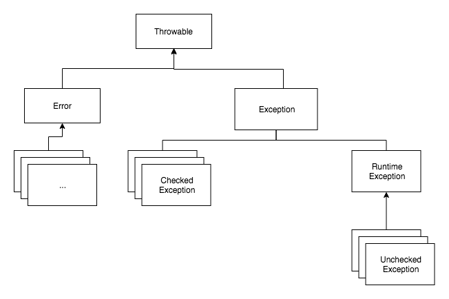

# Checked Exception, Unchecked Exception

 자바의 예외는 크게 **Error**, **Checked Exception**, **Unchecked Exception** 세 가지로 분류된다.

## Error
에러는 시스템에 비정상적인 상황이 생길 경우 발생한다. 
시스템 레벨에서 발생하는 오류이기 때문에 개발자가 예측하기 어렵고 처리할 수도 없다. 
대표적인 에러로는 `OutOfMemory`, `StackOverFlow` 등이 있다.

## Exception
예외(Exception)는 개발자가 만든 어플리케이션에서 잘못된 상황이 발생했을 경우 사용된다. 
예외는 프로그램에 오류이기 때문에 복구가 가능한 수준이며 예외에 대한 예방 또한 가능하다.

|                            | Checked Exception                                            | Unchecked Exception                                          |
| -------------------------- | ------------------------------------------------------------ | ------------------------------------------------------------ |
| 처리 여부                  | 반드시 예외를 처리해야 함                                    | 명시적인 처리를 강제하지 않음                                |
| 확인 시점                  | Compile Time                                                  | Run Time                                                    |
| 예외 발생 시 트랜잭션 롤백 처리 | X                                          | O                                                 |
| 대표 예외                  | `IOException` `SQLException` | `NullPointerException` `IndexOutOfBoundException` |

예외는 크게 `Checked Exception`, `Unchecked Exception`으로 나뉜다. 
이 둘의 구분은 `RuntimeException`를 상속하고 있는지와 로직에 대한 **예외 처리 여부**이다.

### Checked Exception 
해당 예외가 발생할 여지가 있는 로직에 대해 반드시 **예외처리**(try-catch or throw)를 해줘야 한다. 
예외처리가 되지 않으면 컴파일 단계에서 검사된다.

### Unchecked Exception 
대부분의 경우 개발자의 실수로 발생한 예외이다. 
명시적인 예외처리를 강제하지 않지만 로직 중에 문제가 발생을 미리 예상하고 예외처리를 잘 해주어야 한다. 

컴파일 단계에서 체크되지 못하고, 런타임 중 발생하게 된다. 
로직 처리 도중 해당 Exception 이 발생하게 되면 해당 트랜잭션에 대한 롤백이 수행된다.

---
https://devlog-wjdrbs96.tistory.com/351
https://cheese10yun.github.io/checked-exception/

