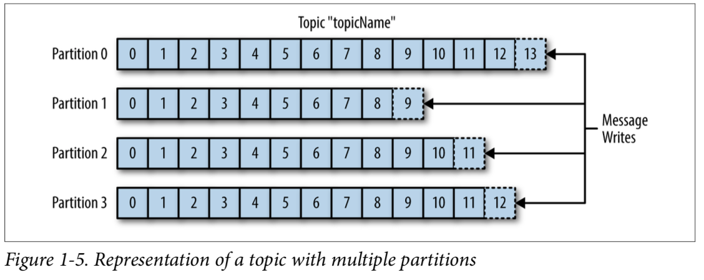
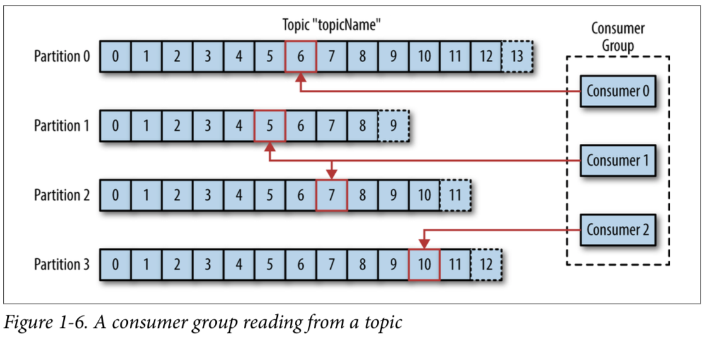

# Kafka 용어집

## Kafka

- Pub-Sub 모델의 MQ(Message Queue) 이며, 분산 환경에 특화되어 있다.
- 링크드인에서 개발한 분산 메세지 시스템으로 2011년에 오픈소스로 공개되었다.

## Pub-Sub

- Publish-Subscribe
    - 발행자와 구독자의 관계가 조성되는 개념
- Message를 바로 수신자에게 보내지 않고, 발행자가 Message를 구분하여 Pub-Sub 시스템에 전송하면 구독자가 특정 부류의 Message를 구독할 수 있게 한다. 이 때, 발행된 Message를
  저장하고 중계하는 역할을 브로커가 수행한다.

## Message

- 카프카에서는 데이터의 기본 단위를 Message라고 한다.

## Topic & Partition

- Message는 Topic으로 분류되며 Topic은 여러개의 partition으로 나뉜다. partition 내의 한 칸은 로그라고 불린다.
- 데이터는 한 칸의 로그에 순차적으로 append된다.
- Message의 상대적인 위치를 나타내는 값은 offset이다.
- 각 partition은 서로 다른 서버에 분산될 수 있다. 하지만 하나의 Topic이 여러 서버에 걸쳐 수평적 확장 될 수 있으므로 단일 서버로 처리할 때 보다 성능이 우수하다.

## Producer

- 새로운 Message를 생성한다.

## Consumer

- 하나 이상의 Topic을 구독하여 Message가 생성된 순새대로 읽는다.
- Message의 offset을 유지하여 읽는 Message의 위치를 알 수 있다.
- Offset은 지속 증가하는 정수이며, Message가 생성될 때 Kafka에서 추가해준다. Partition에 추가된 Message는 고유한 Offset을 갖는다. Zookeeper나 Kafka에서 각
  Partition에서 마지막에 읽은 Message의 Offset을 저장하고 있으므로 Consumer가 Message 읽기를 중단했다가 다시 시작하더라도 언제든 그 다음 Message부터 읽을 수 있다.

## Consumer Group

- Consumer Group은 하나 이상의 Consumer로 구성되며, 한 Topic을 읽고 처리하기 위해 같은 Group의 여러 Consumer가 동작한다.
- 한 Topic은 각 Partition은 하나의 Consumer만 소비할 수 있다 -> 반드시 해당 Topic의 Partition은 그 Consumer Group과 1:N 매칭을 이뤄야 한다.
    - case 1
      - Partition 3개, Consumer 2개 조합 = Consumer 중 하나는 2개의 Partition을 소비
    - case 2
      - Partition 3개, Consumer 3개 조합 = 1:1 매칭
    - case 3
      - Partition 3개, Consumer 4개 조합 = Consumer 하나는 놀게 됨.
- Message가 쌓이는 속도보다 처리하는 속도가 더 빠르다면 1:1 매칭보다 Partition Count => Consumer Count로 설정하는 것이 일반적이다.
- Consumer Group은 하나의 Topic을 책임진다. 따라서 어떤 Consumer가 죽으면 Consumer Group에서 다시 Consumer들의 Partition 소유권을 조정한다. 그래서 다른 Consumer가 그 Partition을 맡아 다시 처리하기 시작하고, 이를 Rebalance라고 한다.

## Broker (중개자)
- 하나의 Kafka 서버는 하나의 Broker이다.
- Broker는 Producer로부터 Message를 수신하고 Offset을 지정한 후 해당 Message를 디스크에 저장한다.
- Consumer의 Partition 읽기 요청에 응답하고 디스크에 수록된 Message를 전송한다.
- 동일한 노드에서 여러 Broker를 띄울 수 있다. => Zookeeper는 이러한 분산 MQ 정보를 관리하는 역할을 한다. 따라 Kafka 시랳ㅇ에는 Zookeeper 실행이 필수적이다.
- 클러스터링 - Kafka의 Broker은 Cluster의 일부로 동작하도록 설계되었다. 따라 여러 개의 Broker가 하나의 클러스터에 포함될 수 있으며, 그 중 하나는 자동으로 선정되는 Cluster Controller의 기능을 수행한다. 컨트롤러는 같은 Cluster의 각 Broker에게 담당 Partition을 할당하고 Broker들이 정상적으로 동작하는지 모니터링한다.

---

- https://deep-dive-dev.tistory.com/50