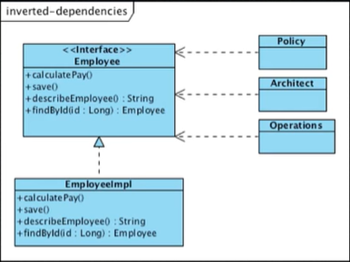

# SOLID

## SRP - (Single Responsibility Principle)
### 정의
클래스는 하나의 책임만을 가져야 한다. 
(=모듈은 하나의 변경 사유를 가져야 한다.)

- 하나의 책임
  - 같은 책임을 갖고 있는 기능
- 책임
  - 변경의 근원

변경에 영향을 줄이기 위해 클래스의 책임을 최소화 하는 것이 좋다.

### Inverted Dependencies (의존성 역전)

- 클래스를 인터페이스와 클래스로 분리

- Actor 를 클래스에서 분리

### Extract Classes 

### Interface Segregation

- 각 인터페이스마다 별도의 클래스로 구현
- 장점 
  - Actor 들이 완전히 분리됨
- 단점
  - 어디에 구현되었는지 찾기 어려움.
  - 하나의 클래스에 구현되어 구현은 결합되어 있음.

## OCP - (Open Closed Principle)
OCP 는 확장에는 열려있고 변경에는 닫혀있는 것을 의미한다.

Abstract 를 통해 고수준 모듈과 저수준 모듈의 연결고리를 인터페이스를 통해 느슨하게 하자.

OCP는 시스템 아키텍처의 핵심이며, OCP를 잘 준수하면 **변경을 최소화 되는** 아키텍처를 얻을 수 있다.

## LSP - (Liskov Substitution Principle)
OCP와 짝 느낌

- OCP를 받쳐주는 다형성에 관한 원칙을 제공
- LSP가 위반되면 OCP도 위반됨
- instanceof/downcasting 사용은 전형적인 LSP 위반의 징조

### ISP - (Interface Segregation Principle)
클래스와 클래스 서로 의존하고 있다, 근데 서브 클래스가 여러개이고 그 클래스에 변경 사항이 된다면 수퍼 클래스에도 영향을 미칠 수 있다. 
이것을 해결하기 위해 ISP 를 제시하고, 인터페이스라는 다리를 놓는다.

클라이언트 클래스와 수퍼 클래스를 Interface를 이용하여 분리한다.

### DIP - Dependency Inversion Principle
고수준 모듈은 저수준 모듈에 의존해선 안된다.

DIP를 통해 고수준 모듈을 저수준 모듈로부터 보호한다.

기존에 A모듈과 C모듈이 서로 의존하고 있다면, 변경사항이 생길 시 서로 영향을 받게 될 것이다.

만약 A모듈과 C모듈 사이에 B라는 추상화 인터페이스라는 다리가 있다면? 
C에 대한 변경된 요구사항이 생기면 B와 C만 수정하면 된다. 
